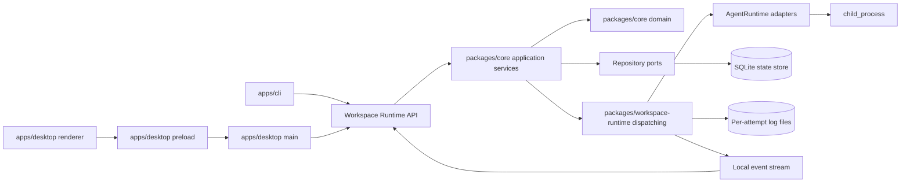

# feat: Build Agent Task Board MVP

## Problem Frame
实现一个面向本地单人使用的 agent 任务看板 MVP。系统需要在单一工作目录上下文内，为 `Claude Code` 与 `Codex CLI` 提供稳定的任务派发、执行监控、人工验收、失败重开与归档闭环，同时让 `CLI` 和 `Electron` 共享同一套底层任务空间与实时状态。

这次实现是 greenfield。仓库当前只有需求文档，没有现成工程骨架、技术清单、测试框架或历史实现模式可复用。因此这份计划不仅要拆功能，还要先定义工程骨架、模块边界和运行时 ownership，避免在实现期把调度、状态机、CLI、Electron 反向耦合在一起。

## Origin and Scope

### Origin Document
- [docs/brainstorms/2026-03-29-agent-task-board-requirements.md](D:\Code\Projects\tasks-dispatcher\docs\brainstorms\2026-03-29-agent-task-board-requirements.md)

### In Scope
- 本地单机、单工作目录任务空间
- `Claude Code` / `Codex CLI` 两种 agent runtime
- 任务主状态机与内部执行阶段
- 单次执行单 agent、多个任务并发、全局固定并发上限、FIFO 调度
- `CLI` 作为 agent 控制面
- `Electron` 作为人类可视化看板
- 共享实时状态与日志流

### Out of Scope
- 多用户协作、权限、多租户
- 运行中切换工作目录
- 多 agent 编排、自定义流程、流程编辑器
- 自动验收、自动归档、AI 审核
- 远程 worker、分布式执行集群

## Requirements Trace

| Area | Covered Requirements | Planning Consequence |
| --- | --- | --- |
| 任务定义与编辑 | R1-R4, R22, R24-R27, R30-R32 | 任务空间必须绑定当前工作目录；创建态为草稿；流程字段只读展示；CLI 默认以 cwd 进入任务空间 |
| 状态机与执行生命周期 | R5-R13, R21, R23, R25, R28 | 领域层必须统一收口状态转换；调度层负责 FIFO 与并发；任务与 attempt 必须分离 |
| 观测与验证 | R14-R17 | 需要同时保存任务状态、attempt 元数据、事件时间线和原始日志流 |
| 入口分工与共享空间 | R18-R20, R29-R32 | CLI 和 Electron 不能各自拥有调度器；必须共享同一运行时和底层数据 |

## Context and Research

### Local Research
- 当前仓库只有一份 requirements 文档，没有 `package.json`、`go.mod`、`Dockerfile`、`src/`、`tests/` 等实现层内容。
- `docs/solutions/` 与 `docs/solutions/patterns/critical-patterns.md` 均不存在，没有可复用的 institutional learnings。
- 因为没有本地实现模式，计划必须以 origin doc 为唯一真相源，并在第一版就把边界切清。

### External Research
- Electron 官方文档明确区分 `main` / `renderer` 进程模型，并建议通过 `preload` 与 `contextBridge` 暴露受控 API，而不是让 renderer 直接接触 Node 能力。
- Node 官方 `child_process` API 足以承载本地 agent 进程的启动、日志流监听、退出码判断与人工中止。

### Planning Implications
- 运行时 ownership 不能放在 Electron renderer，也不能直接放在 CLI 命令处理器里。
- 既然 `CLI` 与 `Electron` 可能同时接入同一任务空间，就必须有单一的工作目录运行时 owner，避免双调度器竞争。
- 由于任务存在失败、重开和重复执行，领域模型必须显式区分 `Task` 与 `TaskAttempt`。

## Key Technical Decisions

### 1. Use a TypeScript workspace with a shared core and separate interface apps
- Decision: 采用 Node.js + TypeScript workspace 结构，拆成 `packages/core`、`packages/workspace-runtime`、`apps/cli`、`apps/desktop`，并在 `packages/workspace-runtime` 内明确分出 `client` 与 `server/infra` 两个公开表面。
- Rationale: 这是在 greenfield 条件下最直接支持 `Electron + CLI + shared core` 的方案，同时能把 OOP 边界落到包级和目录级，而不是只靠代码自觉。
- Alternatives considered:
  - 单包 `src/core + src/cli + src/electron`：初期更快，但边界容易糊，后续最容易被入口层反向侵入。
  - 多语言拆分：没有必要，MVP 不该把复杂度浪费在跨语言通信和构建链上。

### 2. Introduce a per-workspace local runtime service as the single owner of scheduling
- Decision: 每个工作目录由一个本地运行时服务负责调度、持久化、agent 进程 supervision 与事件广播；CLI 与 Electron 都作为客户端接入。
- Rationale: 如果 CLI 和 Electron 都直接内嵌调度器，同一目录双开时会发生重复派发、并发计数失真和日志 ownership 混乱。单运行时 owner 能天然满足 R29。
- Alternatives considered:
  - 让 CLI/Electron 各自直接操作数据库并自行调度：实现更快，但违反低耦合目标，且共享空间行为不稳定。
  - 只允许单入口：和已定需求冲突，且会削弱 CLI 给 agent 用的价值。

### 3. Keep the state machine in the domain layer and keep scheduling outside it
- Decision: `TaskStateMachine` 只负责“允不允许从 A 到 B”，`TaskScheduler` / `ExecutionCoordinator` 只负责“什么时候运行、如何监督运行”。
- Rationale: 这是最关键的低耦合边界。状态机一旦分散到 CLI、IPC handler、scheduler 里，规则会很快漂移。

### 4. Persist task state in SQLite and store raw logs as per-attempt files
- Decision: 工作目录内创建 `.tasks-dispatcher/`，其中使用 SQLite 保存任务、attempt、事件、运行时元数据，使用独立日志文件保存每个 attempt 的原始输出。
- Rationale: SQLite 更适合共享读写、排序查询、状态恢复和 FIFO 调度；原始日志则更适合流式追加与后续回放。
- Alternatives considered:
  - 全 JSON/JSONL：初期简单，但很容易在 CLI/Electron 同时接入时遇到锁、原子更新和查询成本问题。
  - 全部写进 SQLite：也可行，但原始日志流式写入和 tail 能力会更别扭。

### 5. Model `Task` and `TaskAttempt` as separate objects
- Decision: `Task` 表示稳定业务对象，`TaskAttempt` 表示一次具体执行；日志、阶段、终止原因、开始结束时间都归 `TaskAttempt`。
- Rationale: R8-R16, R23, R28 天然要求重试与历史追踪。把 attempt 塞进 task 的当前字段里，后续一定会覆盖历史。

### 6. Fix the internal concurrency cap to `2` for MVP
- Decision: 第一版内部常量固定最大并行任务数为 `2`。
- Rationale: 能体现“支持多个任务并发”，也比 `1` 更符合需求；同时又不会像更高值那样让本机资源、日志观察和调度行为在 MVP 阶段失控。
- Note: 保持为内部常量，不在第一版暴露配置面。

### 7. Treat process completion mechanically, not semantically
- Decision: 运行时将“exit code 0 且非人工中止”视为执行完成，推进到 `待验证`；将非零退出、信号终止、启动失败或 supervisor 判定异常结束视为 `执行失败`。是否“代码真的正确”仍由 agent 的 `自检` 和人类的 `待验证` 共同承担。
- Rationale: 这符合当前产品范围，避免 MVP 误入自动验收语义。

### 8. Prefer focused OO collaborators over script-style managers
- Decision: 核心实现优先使用职责单一的对象协作，例如 `TaskStateMachine`、`TaskScheduler`、`ExecutionCoordinator`、`WorkspaceStorage`、`AgentProcessSupervisor`、`WorkspaceRuntimeClient`，而不是把行为堆进一个巨大的 manager 或脚本文件。
- Rationale: 用户已明确要求模块清晰、低耦合、OOP 优先。对这个系统来说，最危险的不是类太多，而是入口层、调度层、状态机和存储层被一个 god object 粘死。
- Guardrails:
  - 一个对象只拥有一个明确理由发生变化
  - 入口层不创建绕过应用层的快捷逻辑
  - 不创建同时理解状态机、存储、IPC 和 UI 的复合对象

### 9. Keep the workspace runtime alive only while it is useful
- Decision: 工作目录运行时按需启动；当仍有活跃客户端连接或仍有运行中的任务时保持存活，空闲后按短暂 idle timeout 自动退出。
- Rationale: 这样既能满足 CLI/Electron 共享同一任务空间，又不会把第一版做成难回收的常驻后台进程。

### 10. Use TailwindCSS + daisyUI for the Electron renderer
- Decision: Electron renderer 采用 React + TailwindCSS + daisyUI 组织样式与视觉组件。
- Rationale: 这是你新增指定的 GUI 技术约束，适合在 greenfield 阶段快速建立统一桌面视觉语言，同时不影响核心层和运行时层的边界。
- Constraint: TailwindCSS 与 daisyUI 只存在于 renderer 表现层，不得渗透到 preload、main、core、runtime 的接口设计。

### 11. Standardize on pnpm as the only package manager
- Decision: 整个工程统一使用 `pnpm` 作为唯一包管理器和 workspace 工具，不使用 `npm`。
- Rationale: 计划已经采用 `pnpm-workspace.yaml`，继续允许 `npm` 只会让锁文件、脚本习惯和工作区行为变得不一致。
- Constraint: 生成与执行文档、脚本、启动命令、安装步骤时都默认 `pnpm`，不提供 `npm` 等价写法。

## High-Level Technical Design

This diagram is illustrative. It shows ownership and boundaries, not implementation code.



### Logical Layering
- `domain`: 状态机、可编辑性、attempt 生命周期规则
- `application`: 用例编排，只依赖抽象接口
- `dispatching`: FIFO、并发门、运行监督、日志采集
- `infrastructure`: SQLite、日志文件、child_process、事件广播
- `interfaces`: CLI / Electron 只负责输入输出

## Proposed Repository Layout

```text
apps/
  cli/
  desktop/
packages/
  core/
  workspace-runtime/
docs/
  brainstorms/
  plans/
```

### Core Package Internal Layout

```text
packages/core/src/
  domain/
  application/
  ports/
  contracts/
```

### Runtime Package Internal Layout

```text
packages/workspace-runtime/src/
  bootstrap/
  client/
  persistence/
  dispatching/
  agents/
  events/
  server/
```

## Implementation Units

### [x] Unit 1: Scaffold the workspace and harden package boundaries

**Goal**
- 建立能承载 `core/runtime/cli/desktop` 四块的 workspace 骨架，并把跨包依赖关系卡死。

**Primary files**
- `package.json`
- `pnpm-workspace.yaml`
- `tsconfig.base.json`
- `vitest.workspace.ts`
- `apps/cli/package.json`
- `apps/desktop/package.json`
- `packages/core/package.json`
- `packages/workspace-runtime/package.json`
- `packages/core/tsconfig.json`
- `packages/workspace-runtime/tsconfig.json`
- `apps/cli/tsconfig.json`
- `apps/desktop/tsconfig.json`
- `apps/desktop/tailwind.config.ts`
- `apps/desktop/postcss.config.mjs`
- `apps/desktop/src/renderer/styles/tailwind.css`

**Approach**
- 用 workspace 把入口和核心拆开，而不是先写功能后补拆分。
- 包管理器统一为 `pnpm`，并在工程初始化阶段就锁定 workspace、脚本和依赖安装方式。
- 在 TypeScript 路径和包依赖上限制：
  - `apps/cli` 只能依赖 `packages/core` 的 contracts 与 `packages/workspace-runtime` 的 `client` 表面
  - `apps/desktop` renderer 不能直接依赖 Node-only runtime 实现
  - `apps/desktop` main/preload 只能依赖 `packages/workspace-runtime` 的 `client` 表面，不能直接依赖 `server`、`persistence`、`dispatching`
  - `packages/core` 不依赖 Electron、CLI、Node child process、SQLite
- 给 `apps/desktop` 预留 `main/preload/renderer` 三层目录。
- 在 `apps/desktop` 初始化 TailwindCSS + daisyUI，但限制它们只出现在 renderer 层。

**Test files**
- `packages/core/tests/architecture/core-boundaries.test.ts`
- `apps/desktop/src/main/__tests__/ipc-surface-contract.test.ts`

**Test scenarios**
- `packages/core` 不引入 Node-only、Electron-only 依赖。
- Electron renderer 只能通过 preload 暴露的 contract 访问运行时能力。
- CLI 与 desktop 都能编译引用共享 contracts，而不直接引用彼此实现。

### [x] Unit 2: Implement the domain model and application services

**Goal**
- 把任务空间最核心的业务规则写进 OOP 领域对象和用例服务，形成唯一可信规则源。

**Primary files**
- `packages/core/src/domain/Task.ts`
- `packages/core/src/domain/TaskAttempt.ts`
- `packages/core/src/domain/TaskState.ts`
- `packages/core/src/domain/ExecutionStage.ts`
- `packages/core/src/domain/TaskEvent.ts`
- `packages/core/src/domain/TaskStateMachine.ts`
- `packages/core/src/domain/WorkspaceSession.ts`
- `packages/core/src/application/services/CreateTaskService.ts`
- `packages/core/src/application/services/QueueTaskService.ts`
- `packages/core/src/application/services/ReopenTaskService.ts`
- `packages/core/src/application/services/ArchiveTaskService.ts`
- `packages/core/src/application/services/AbortTaskService.ts`
- `packages/core/src/application/services/GetTaskBoardService.ts`
- `packages/core/src/ports/TaskRepository.ts`
- `packages/core/src/ports/TaskEventStore.ts`
- `packages/core/src/ports/AgentRuntimeRegistry.ts`
- `packages/core/src/contracts/TaskDtos.ts`

**Approach**
- 所有状态转换都经 `TaskStateMachine` 或等价 domain service 收口。
- `Task` 与 `TaskAttempt` 显式分离。
- `application` 只组织用例，不接触持久化细节或子进程。
- 在这一层就固化：
  - `初始化` / `重新打开` 可编辑
  - `待执行` 及其后续锁定
  - `执行失败` 不能直接编辑
  - `执行失败 -> 重新打开` 和 `执行失败 -> 待执行` 两条人工路径

**Test files**
- `packages/core/tests/domain/TaskStateMachine.test.ts`
- `packages/core/tests/domain/TaskAttempt.test.ts`
- `packages/core/tests/application/TaskLifecycleServices.test.ts`

**Test scenarios**
- 新建任务默认进入 `初始化`，且流程字段固定为默认流程。
- `初始化 -> 待执行 -> 执行中 -> 待验证 -> 归档` 主链规则完整。
- `待验证 -> 重新打开 -> 待执行` 返工链正确。
- `执行中 -> 执行失败`、`执行失败 -> 重新打开`、`执行失败 -> 待执行` 规则正确。
- `待执行`、`执行中`、`待验证`、`执行失败` 下编辑限制符合需求。
- 任务切回 `待执行` 时不会覆盖旧 attempt，而是创建新 attempt。

### [x] Unit 3: Build workspace persistence and storage layout

**Goal**
- 为单工作目录任务空间建立稳定的本地存储结构，支撑共享访问、状态恢复和历史追踪。

**Primary files**
- `packages/workspace-runtime/src/persistence/WorkspaceStorage.ts`
- `packages/workspace-runtime/src/persistence/SqliteTaskRepository.ts`
- `packages/workspace-runtime/src/persistence/SqliteTaskEventStore.ts`
- `packages/workspace-runtime/src/persistence/SqliteWorkspaceSessionStore.ts`
- `packages/workspace-runtime/src/persistence/migrations/001_initial_schema.sql`
- `packages/workspace-runtime/src/persistence/TaskLogFileStore.ts`
- `packages/workspace-runtime/src/bootstrap/WorkspacePaths.ts`

**Expected workspace layout**
- `<workspace>/.tasks-dispatcher/state.sqlite`
- `<workspace>/.tasks-dispatcher/logs/<task-id>/<attempt-id>.log`
- `<workspace>/.tasks-dispatcher/runtime/`

**Approach**
- 用 SQLite 保存 task、attempt、event、runtime metadata。
- 用日志文件保存原始标准输出/标准错误。
- 所有路径都由 `WorkspacePaths` 统一生成，杜绝入口层自己拼路径。
- 为同工作目录共享访问预留锁与单 owner 标记。

**Test files**
- `packages/workspace-runtime/tests/persistence/WorkspaceStorage.test.ts`
- `packages/workspace-runtime/tests/persistence/SqliteTaskRepository.test.ts`
- `packages/workspace-runtime/tests/persistence/TaskLogFileStore.test.ts`

**Test scenarios**
- 第一次进入工作目录时能自动初始化 `.tasks-dispatcher/` 结构。
- 重新打开同一工作目录时能恢复既有任务、attempt 和事件。
- 切换到另一个目录时会得到独立的状态库和日志目录。
- 原始日志追加不会覆盖既有日志内容。
- FIFO 查询按 `待执行` 入队时间稳定排序。

### [x] Unit 4: Implement dispatching, agent runtimes, and execution supervision

**Goal**
- 让系统能真正按 FIFO 和固定并发上限派发任务，监督 agent 进程，采集日志并推进 attempt 生命周期。

**Primary files**
- `packages/workspace-runtime/src/dispatching/TaskScheduler.ts`
- `packages/workspace-runtime/src/dispatching/ConcurrencyGate.ts`
- `packages/workspace-runtime/src/dispatching/ExecutionCoordinator.ts`
- `packages/workspace-runtime/src/dispatching/AgentProcessSupervisor.ts`
- `packages/workspace-runtime/src/agents/AgentRuntime.ts`
- `packages/workspace-runtime/src/agents/ClaudeCodeRuntime.ts`
- `packages/workspace-runtime/src/agents/CodexCliRuntime.ts`
- `packages/workspace-runtime/src/agents/NodeChildProcessRunner.ts`
- `packages/workspace-runtime/src/events/LocalEventBus.ts`

**Approach**
- `TaskScheduler` 只关心待执行队列、FIFO 和并发槽位。
- `ExecutionCoordinator` 负责将 domain/application 决策与 runtime 事件连接起来。
- `AgentRuntime` 封装命令行拼接、stage prompt 套壳与 runtime metadata。
- `AgentProcessSupervisor` 统一处理：
  - 启动成功/失败
  - 标准输出/错误输出
  - exit code 与 signal
  - 人工中止
  - attempt 终止原因记录
- 默认最大并行任务数固定为 `2`。

**Test files**
- `packages/workspace-runtime/tests/dispatching/TaskScheduler.test.ts`
- `packages/workspace-runtime/tests/dispatching/ExecutionCoordinator.test.ts`
- `packages/workspace-runtime/tests/agents/AgentProcessSupervisor.test.ts`
- `packages/workspace-runtime/tests/agents/AgentRuntimeRegistry.test.ts`

**Test scenarios**
- 当两个槽位都空闲时，前两个 `待执行` 任务会被启动。
- 当槽位不足时，后续任务按 FIFO 等待。
- 同一种 agent 可以同时启动多个实例，但每个进程只处理一个任务。
- 人工中止会终止进程、写入终止原因，并把任务置为 `执行失败`。
- 非零退出、信号终止、启动失败都会落到 `执行失败`。
- 正常退出会推进到 `待验证`，并保留完整 attempt 元数据与日志。

### [x] Unit 5: Build the workspace runtime API and shared event stream

**Goal**
- 让 CLI 与 Electron 能共享同一工作目录任务空间，并看到一致的实时状态和日志。

**Primary files**
- `packages/core/src/contracts/WorkspaceRuntimeApi.ts`
- `packages/workspace-runtime/src/server/WorkspaceServer.ts`
- `packages/workspace-runtime/src/client/WorkspaceRuntimeClient.ts`
- `packages/workspace-runtime/src/client/WorkspaceRuntimeConnector.ts`
- `packages/workspace-runtime/src/server/WorkspaceClientSession.ts`
- `packages/workspace-runtime/src/server/TaskCommandHandlers.ts`
- `packages/workspace-runtime/src/server/TaskQueryHandlers.ts`
- `packages/workspace-runtime/src/server/TaskEventStream.ts`
- `packages/workspace-runtime/src/bootstrap/RuntimeLauncher.ts`
- `packages/workspace-runtime/src/bootstrap/RuntimeLock.ts`

**Approach**
- 用本地 IPC 通道把运行时服务暴露给 CLI 与 Electron。
- `RuntimeLauncher` 负责“存在就连，不存在就拉起”，确保同目录只有一个运行时 owner。
- client 只通过 `WorkspaceRuntimeClient` 与 `WorkspaceRuntimeConnector` 访问运行时，不直接引用 server/dispatching/persistence 细节。
- 命令和查询协议只暴露 task/attempt DTO，不把 repository 或 scheduler 细节外泄。
- 事件流统一广播任务状态变化、阶段变化、日志片段、attempt 生命周期事件。
- 运行时在“无活跃客户端且无运行中任务”时才允许空闲退出，避免中途丢失调度 ownership。

**Test files**
- `packages/workspace-runtime/tests/server/WorkspaceServer.test.ts`
- `packages/workspace-runtime/tests/server/RuntimeLauncher.test.ts`
- `packages/workspace-runtime/tests/client/WorkspaceRuntimeClient.test.ts`
- `packages/workspace-runtime/tests/integration/SharedWorkspaceParity.test.ts`

**Test scenarios**
- CLI 与 Electron 同时连接同一目录时，读取到同一份任务列表。
- 同一目录下不会启动两个运行时 owner。
- 一个入口创建/派发/归档任务后，另一个入口能实时收到事件并刷新状态。
- 日志流能被多个订阅端同时消费，不造成重复写入。
- 运行时在仍有运行中任务时不会因为客户端暂时断开而提前退出。
- 运行时在无客户端且无运行中任务时会按 idle timeout 自动回收。

### [x] Unit 6: Deliver the agent-facing CLI

**Goal**
- 提供给 agent 使用的命令式控制面，支持任务创建、派发、状态推进、查询和实时观察。

**Primary files**
- `apps/cli/src/index.ts`
- `apps/cli/src/commands/task/create.ts`
- `apps/cli/src/commands/task/queue.ts`
- `apps/cli/src/commands/task/reopen.ts`
- `apps/cli/src/commands/task/archive.ts`
- `apps/cli/src/commands/task/abort.ts`
- `apps/cli/src/commands/task/show.ts`
- `apps/cli/src/commands/task/watch.ts`

**Approach**
- CLI 默认以 cwd 作为任务空间，不要求额外 path 参数。
- 每个 command handler 只做参数解析、共享 runtime client 调用和结果展示。
- 为 agent 使用优化输出：task id、状态、简洁错误、watch 模式日志流。
- 明确区分：
  - `reopen`：从 `执行失败` 或 `待验证驳回` 进入返工态
  - `queue`：把 `初始化` / `重新打开` / `执行失败` 显式切回 `待执行`

**Test files**
- `apps/cli/tests/create-command.test.ts`
- `apps/cli/tests/state-commands.test.ts`
- `apps/cli/tests/watch-command.test.ts`

**Test scenarios**
- 在 cwd 下创建任务会命中对应目录的任务空间。
- 创建命令默认生成 `初始化` 草稿任务。
- `queue`、`reopen`、`archive`、`abort` 只允许在合法状态下执行。
- `watch` 能看到状态变化、阶段变化和日志输出。
- 不合法状态转换时，CLI 输出清楚错误而不是静默失败。

### [x] Unit 7: Deliver the human-facing Electron board

**Goal**
- 提供接近传统任务看板的人类操作面，支持浏览任务、查看日志、验证归档和返工。

**Primary files**
- `apps/desktop/src/main/main.ts`
- `apps/desktop/src/main/ipc/taskIpcHandlers.ts`
- `apps/desktop/src/preload/taskBoardApi.ts`
- `apps/desktop/src/renderer/App.tsx`
- `apps/desktop/src/renderer/styles/tailwind.css`
- `apps/desktop/src/renderer/pages/TaskBoardPage.tsx`
- `apps/desktop/src/renderer/components/TaskList.tsx`
- `apps/desktop/src/renderer/components/TaskDetailPane.tsx`
- `apps/desktop/src/renderer/components/TaskComposer.tsx`
- `apps/desktop/src/renderer/components/TaskLogStream.tsx`
- `apps/desktop/src/renderer/components/TaskStatusActions.tsx`

**Approach**
- `main` 负责窗口生命周期、任务空间选择入口、IPC 绑定和 runtime client。
- `preload` 暴露窄 API，renderer 不直接接触 Node。
- `renderer` 重点支持：
  - 看板列表和详情面板
  - 只读流程字段展示
  - 实时日志流
  - `待验证 -> 归档 / 重新打开`
  - `执行失败 -> 待执行 / 重新打开`
- renderer 使用 TailwindCSS + daisyUI 组织视觉样式，但业务状态仍通过 runtime API 驱动，而不是塞进样式组件内部。
- 第一次进入系统时选择工作目录；进入后本次会话不允许切目录。

**Test files**
- `apps/desktop/src/main/__tests__/taskIpcHandlers.test.ts`
- `apps/desktop/src/renderer/__tests__/TaskBoardPage.test.tsx`
- `apps/desktop/src/renderer/__tests__/TaskStatusActions.test.tsx`

**Test scenarios**
- 首次进入时必须选择工作目录，进入后不能切换目录。
- 看板能展示任务状态、阶段、attempt 时间和最近事件。
- 日志流会随着运行时事件实时更新。
- 人类只能在允许的状态下看到对应按钮。
- GUI 与 CLI 同时使用时，状态变化和日志表现一致。
- TailwindCSS 与 daisyUI 仅影响 renderer 表现，不改变 preload/main/core/runtime 边界。

## System-Wide Impact
- 会新增一个工作目录级隐藏数据目录 `.tasks-dispatcher/`。
- 会新增一个本地运行时进程，负责同目录任务空间的调度与监督。
- CLI 和 Electron 将共享同一运行时与同一份底层状态，不再是两个独立实现。
- 引入 SQLite 与日志文件双存储模式，需要在实现时保证恢复和锁语义清晰。

## Risks and Dependencies

### Primary Risks
- 运行时 owner 设计不清，导致 CLI/Electron 双开时重复调度。
- 状态机写散，导致入口层、scheduler、IPC 各自推进状态。
- 把 `Task` 和 `TaskAttempt` 混在一起，导致历史与当前执行互相覆盖。
- Electron renderer 越过 preload 直接接 Node 能力，削弱边界。

### Mitigations
- 把“单运行时 owner”作为 Unit 5 的硬门槛，而不是可选优化。
- 把所有状态转换测试集中在 `packages/core/tests/domain/TaskStateMachine.test.ts`。
- 在 persistence schema 和 DTO 里从一开始就分开 `task` 与 `attempt`。
- 严格把 Electron API 收口在 preload contract。

### External Dependencies
- 本机可调用的 `Claude Code`
- 本机可调用的 `Codex CLI`
- Electron 官方推荐的 main/preload/renderer 边界
- Node `child_process` API

## Open Questions

### Resolved During Planning
- 运行时 owner 形式：采用每工作目录一个本地运行时服务。
- 工程组织形式：采用 TypeScript workspace。
- 并发默认值：第一版固定为 `2`。
- 持久化策略：SQLite + per-attempt log files。
- CLI 入口语义：默认使用 cwd。

### Deferred to Implementation
- `Claude Code` 与 `Codex CLI` 的具体命令参数与 stage prompt 套壳细节，需要在实现时以本机真实可执行行为校准。
- 本地 IPC 通道的最终具体形态（Windows named pipe / Unix domain socket 的统一包装）可在 Unit 5 实现时定案，但不能改变“单运行时 owner”的架构结论。
- SQLite schema 中 event snapshot 的优化程度可在实现时微调，但不能放弃 task/attempt/event 分离。

## Sources and References
- Origin requirements: [docs/brainstorms/2026-03-29-agent-task-board-requirements.md](D:\Code\Projects\tasks-dispatcher\docs\brainstorms\2026-03-29-agent-task-board-requirements.md)
- Electron process model: https://www.electronjs.org/docs/latest/tutorial/process-model
- Electron context isolation: https://www.electronjs.org/docs/latest/tutorial/context-isolation
- Node child processes: https://nodejs.org/api/child_process.html

## Recommended Execution Order
1. Unit 1
2. Unit 2
3. Unit 3
4. Unit 4
5. Unit 5
6. Unit 6
7. Unit 7

## Implementation Readiness Check
- Problem frame and product behavior come directly from the origin doc and are no longer ambiguous.
- The plan names concrete files, concrete module boundaries, and concrete tests.
- The highest-risk architecture decision, `single workspace runtime owner`, is explicit rather than implied.
- The plan preserves low coupling by keeping entrypoints out of domain, persistence, and scheduling internals.
