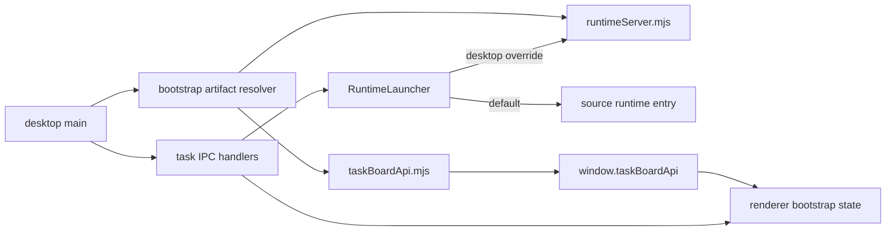

# fix: Harden Desktop Startup Bootstrap

## Problem Frame
桌面应用当前在两条关键启动路径上都不可靠：
- README 指向的 `pnpm dev:desktop` 能起 Electron 窗口，但 renderer 实际为空白，因为 preload 未注入，`window.taskBoardApi` 不存在。
- 直接验证 desktop 构建产物时，workspace runtime 无法启动，主进程报 `Timed out waiting for workspace runtime to start.`。

这不是单个 typo。问题出在 desktop bootstrap contract 没有被显式定义，导致 main 进程、preload 产物名、runtime entrypoint 与 renderer 启动假设各自漂移。结果是用户看到空白页，开发者只看到零散的未处理异常。

## Origin and Scope

### Origin Document
- [docs/brainstorms/2026-03-29-desktop-startup-hardening-requirements.md](D:\Code\Projects\tasks-dispatcher\docs\brainstorms\2026-03-29-desktop-startup-hardening-requirements.md)

### In Scope
- desktop 启动期的 preload 产物解析
- desktop 启动期的 runtime entrypoint 解析与传递
- renderer 启动失败可视化
- main / IPC 层对启动失败的错误传播
- desktop 启动回归测试与最小必要文档补充

### Out of Scope
- 任务看板功能改版
- workspace runtime ownership 模型改版
- agent 执行语义调整
- 安装包、updater、分发形态、脱离源码仓库后的 packaging 方案

## Requirements Trace

| Area | Covered Requirements | Planning Consequence |
| --- | --- | --- |
| Bootstrap asset resolution | R1, R2 | desktop 需要稳定的 preload 输出约定，renderer 不再假设 bridge 一定存在 |
| Runtime bootstrap | R3, R4 | runtime launcher 需要支持当前执行模式下可用的 entrypoint，不能把 bundled main 的相对路径误当成 runtime 源路径 |
| Failure visibility | R5, R6 | main、IPC、renderer 需要统一启动失败信号，避免空白页和未处理 promise rejection |
| Regression protection | R7, R8 | 需要新增一条真实 desktop 启动烟测，以及一条更轻量的 bootstrap 路径契约测试 |

## Context and Research

### Local Research
- [main.ts](/D:/Code/Projects/tasks-dispatcher/apps/desktop/src/main/main.ts#L22) 当前把 preload 写死为 `../preload/taskBoardApi.js`，但 `electron-vite` 实际产物是 `out/preload/preload.mjs`。
- [electron.vite.config.ts](/D:/Code/Projects/tasks-dispatcher/apps/desktop/electron.vite.config.ts) 当前 preload 构建输入 key 是 `preload`，这让生成文件名和源文件名脱钩。
- [RuntimeLauncher.ts](/D:/Code/Projects/tasks-dispatcher/packages/workspace-runtime/src/bootstrap/RuntimeLauncher.ts#L96) 当前通过 `new URL("../server/runtimeServerMain.ts", import.meta.url)` 解析 runtime entrypoint。源码模式可用，但 bundled 到 `apps/desktop/out/main/main.js` 后，这个相对路径会指向不存在的位置。
- [taskIpcHandlers.ts](/D:/Code/Projects/tasks-dispatcher/apps/desktop/src/main/ipc/taskIpcHandlers.ts) 会在后台启动 runtime 订阅，但没有处理 `runtimeClientPromise` rejection，所以 runtime 启动失败时会留下未处理异常。
- [TaskBoardPage.tsx](/D:/Code/Projects/tasks-dispatcher/apps/desktop/src/renderer/pages/TaskBoardPage.tsx#L59) 在首次 effect 中直接调用 `window.taskBoardApi.getWorkspaceInfo()`，bridge 缺失时会让 renderer 启动即崩。
- 现有 desktop 测试只覆盖 IPC surface 和纯静态 render，没有覆盖真正的 desktop startup path。

### Institutional Learnings
- [single-workspace-runtime-owner-2026-03-29.md](D:\Code\Projects\tasks-dispatcher\docs\solutions\best-practices\single-workspace-runtime-owner-2026-03-29.md) 明确要求 runtime discovery / startup 保持单一入口，修复时不能把 desktop 变成绕过 `RuntimeLauncher` 的特例。
- [windows-codex-process-launch-gotchas-2026-03-29.md](D:\Code\Projects\tasks-dispatcher\docs\solutions\integration-issues\windows-codex-process-launch-gotchas-2026-03-29.md) 说明本仓库已经接受“针对运行模式做显式启动分支”的策略，这和本次为 desktop bootstrap 引入显式 entry resolution 是一致的。

### External Research
- 不做额外外部研究。当前问题是仓内构建产物命名、入口路径和错误传播的不一致，不是框架能力未知。

### Planning Implications
- 修复不能只改一个路径字符串，否则另一条启动链还是会坏。
- desktop 需要显式拥有自己的 bootstrap artifact contract，但 runtime ownership 仍由 `RuntimeLauncher` 统一收口。
- smoke coverage 必须覆盖真正的 Electron startup，而不是继续停留在纯 source-level render 测试。

## Execution Posture
- Characterization-first。先把当前失败行为固化成 bootstrap contract tests、renderer startup failure tests 和真实 Electron smoke test，再改启动代码。
- 保持两层验证：
  - 快反馈层：纯 node / vitest 的契约与状态测试
  - 真实启动层：带 Electron 进程的 smoke test
- 不依赖全局工具。新增的真实启动测试必须由仓库内声明的依赖和脚本直接运行。

## Key Technical Decisions

### 1. Define an explicit desktop bootstrap artifact contract
- Decision: desktop main 不再硬编码猜测产物名，而是通过一个专门的 bootstrap resolver 使用稳定命名规则解析 preload 与 runtime server 产物。
- Rationale: 当前失败就是 contract 不存在，各层都在猜。显式 contract 能把 drift 收口到一个点。
- Alternatives considered:
  - 只把 `taskBoardApi.js` 改成 `preload.mjs`：能解当前 preload 问题，但 runtime path 和后续产物漂移仍无保护。
  - 在 main 里写多个 if/exists fallback：比现在好一点，但会把 contract 继续藏在分支里，长期更难验证。
- Chosen shape:
  - preload artifact 使用与 bridge 语义一致的稳定名，例如 `taskBoardApi.mjs`
  - runtime artifact 使用与 runtime entry 语义一致的稳定名，例如 `runtimeServerMain.mjs`
  - resolver 输出结构化结果，而不是让调用方直接拼路径

### 2. Keep `RuntimeLauncher` generic by adding an optional desktop-specific launch target
- Decision: `RuntimeLauncher` 保留默认源码模式，但支持从调用方接收显式 launch target override；desktop main 传入自己的 runtime server artifact 和执行模式，CLI 继续走默认路径。
- Rationale: 这样既不破坏现有 workspace-runtime 单 owner 模式，也不把 desktop 的 bundled path 假设硬塞回共享运行时包。
- Alternatives considered:
  - 直接在 `RuntimeLauncher` 里写死 desktop build 路径：会污染 CLI 使用场景，边界变差。
  - 让 desktop 绕开 `RuntimeLauncher` 自己启动 runtime：违反现有运行时所有权模式。
- Chosen shape:
  - launch target 至少包含 `entryPath` 和 `mode`
  - `mode` 明确区分 `tsx-source` 与 `node-bundled`
  - `RuntimeLauncher` 只消费 launch target，不理解 desktop UI 或窗口上下文

### 3. Treat startup failure as first-class UI state
- Decision: renderer 启动要有明确的 bootstrap state，至少区分 `bridge missing`、`runtime bootstrap failed`、`ready`。
- Rationale: 空白页本身就是 defect 的一部分。修复如果只让日志好看而 UI 继续空白，问题没有真的解决。
- Alternatives considered:
  - 只在 main 进程打日志：开发者可见，但用户仍只看到空白页。
  - 让 renderer 全靠 try/catch：能挡一部分，但 preload 缺失时仍需要更早的显式 guard。

### 4. Put startup regression coverage on the real Electron path
- Decision: 增加一条基于仓库内 Playwright Electron driver 的 startup smoke test，验证 desktop 在固定 workspace 下至少能完成 bridge 注入、非空渲染和 runtime metadata 落地。
- Rationale: 这次回归恰好发生在现有 unit tests 全绿的前提下，说明 source-level tests 不足以覆盖 startup contract。
- Alternatives considered:
  - 继续只写纯单元测试：无法证明 Electron 真实启动链没断。
  - 只保留手工 smoke：太容易被跳过，不能满足防回归目标。
  - 自写 CDP 轮询 harness：可以做，但维护成本高于直接使用成熟 Electron test driver。

## High-Level Technical Design

This diagram is illustrative. It shows the intended startup contract, not implementation code.

### Logical Layering
- `apps/desktop/src/main`: 负责 bootstrap contract、窗口生命周期、错误传播入口
- `packages/workspace-runtime/src/bootstrap`: 负责 runtime 启动机制，但不理解 desktop UI
- `apps/desktop/src/preload`: 负责受控 bridge，不承载业务启动逻辑
- `apps/desktop/src/renderer`: 负责把 bridge/runtime 启动结果转成可见状态

## Implementation Units

### [x] Unit 1: Normalize desktop bootstrap artifacts and path resolution

**Goal**
- 让 desktop main 依赖稳定的 preload/runtime artifact contract，而不是散落的相对路径猜测。

**Primary files**
- `apps/desktop/electron.vite.config.ts`
- `apps/desktop/src/main/main.ts`
- `apps/desktop/src/main/bootstrap/resolveDesktopBootstrapArtifacts.ts`
- `apps/desktop/src/main/__tests__/desktopBootstrapArtifacts.test.ts`
- `apps/desktop/src/main/__tests__/ipc-surface-contract.test.ts`

**Approach**
- 引入 `resolveDesktopBootstrapArtifacts()` 一类的专门 helper，统一给 main 提供：
  - preload artifact path
  - runtime server artifact path
  - 缺失 artifact 时的结构化错误
- 调整 `electron-vite` 输出命名，使 preload 和 runtime server 的构建产物名与 desktop contract 对齐，而不是依赖默认 entry key。
- 把“稳定产物名”当作 contract 一部分写进测试断言，避免以后又回到“构建默认给了什么就用什么”。
- `main.ts` 在创建窗口前先通过 resolver 拿到 preload path，不再写死 `taskBoardApi.js`。
- 保持 resolver 为纯函数或接近纯函数，方便在 node 环境下做契约测试。

**Test files**
- `apps/desktop/src/main/__tests__/desktopBootstrapArtifacts.test.ts`
- `apps/desktop/src/main/__tests__/ipc-surface-contract.test.ts`

**Test scenarios**
- 在 desktop 构建输出目录形态下，resolver 能返回 preload 与 runtime server 的稳定路径。
- 当 preload artifact 缺失时，resolver 返回明确错误而不是让 main 在更晚阶段静默失败。
- IPC surface contract 继续保证 renderer 只通过 preload bridge 访问能力，不回退到 Node/Electron 直接暴露。

### [x] Unit 2: Add runtime launch target override without breaking shared runtime ownership

**Goal**
- 让 desktop 能用显式 runtime artifact 启动 workspace runtime，同时保持 CLI 和测试继续复用默认 `RuntimeLauncher` 语义。

**Primary files**
- `packages/workspace-runtime/src/bootstrap/RuntimeLauncher.ts`
- `packages/workspace-runtime/src/bootstrap/RuntimeLaunchTarget.ts`
- `packages/workspace-runtime/src/client/WorkspaceRuntimeConnector.ts`
- `apps/desktop/src/main/ipc/taskIpcHandlers.ts`
- `packages/workspace-runtime/tests/server/RuntimeLauncher.test.ts`
- `packages/workspace-runtime/tests/server/RuntimeLauncherLaunchTarget.test.ts`

**Approach**
- 给 `RuntimeLauncher` 增加可选 launch target 配置，至少允许调用方传入显式 runtime entry path。
- launch target 明确表达“如何执行这个 entry”，而不是只表达“文件在哪”。
- 保留默认行为给 CLI 和现有 runtime tests，用 source-mode path 维持当前开发体验。
- desktop main 侧通过 `taskIpcHandlers` 或更上层 bootstrap wiring 把 resolved runtime artifact 传给 `createWorkspaceRuntimeClient(...)`。
- 保持 `RuntimeLock`、runtime metadata、existing client discovery 逻辑不变，避免把修复演变成 runtime ownership 改版。
- 把启动失败包装成清晰错误对象，而不是裸 rejection 文本。

**Test files**
- `packages/workspace-runtime/tests/server/RuntimeLauncher.test.ts`
- `packages/workspace-runtime/tests/server/RuntimeLauncherLaunchTarget.test.ts`

**Test scenarios**
- 默认 launch path 仍能在源码模式下启动、停止并重连 runtime。
- 显式 launch target 会被优先使用，并在 `node-bundled` 模式下成功写出 `runtime.json`。
- 启动失败时返回清晰错误，不留下新的未处理 promise rejection。
- desktop 传入 override 后不会破坏“同 workspace 单 runtime owner”的语义。
- 当 launch target 指向不存在的 bundle 时，错误能明确标识为 bootstrap target resolution / launch failure，而不是 generic timeout。

### [x] Unit 3: Surface startup failures as visible desktop bootstrap states

**Goal**
- 避免 desktop 在 bridge 缺失或 runtime 启动失败时表现为空白页或只留下后台异常。

**Primary files**
- `apps/desktop/src/main/ipc/taskIpcHandlers.ts`
- `apps/desktop/src/preload/taskBoardApi.ts`
- `apps/desktop/src/renderer/App.tsx`
- `apps/desktop/src/renderer/pages/TaskBoardPage.tsx`
- `apps/desktop/src/renderer/components/DesktopStartupErrorState.tsx`
- `apps/desktop/src/renderer/__tests__/DesktopStartupErrorState.test.tsx`
- `apps/desktop/src/renderer/__tests__/TaskBoardPage.test.tsx`

**Approach**
- renderer 入口先验证 `window.taskBoardApi` 是否存在；缺失时渲染显式 startup error state，而不是直接进入任务看板 effect。
- `TaskBoardPage` 的初始 bootstrap 改成显式 `loading / ready / failed` 状态流，捕获 `getWorkspaceInfo()`、`listTasks()` 和初始订阅阶段的失败。
- `taskIpcHandlers.ts` 里处理 `runtimeClientPromise.then(...)` 的 rejection，防止后台订阅路径留下未处理异常。
- 将 startup failure 归一成有限错误类别，至少覆盖：
  - `bridge_missing`
  - `runtime_bootstrap_failed`
  - `initial_query_failed`
- 错误展示至少要说明：
  - bridge 是否缺失
  - runtime bootstrap 是否失败
  - 已知 workspace root
  - 对开发者足够有用的错误摘要

**Test files**
- `apps/desktop/src/renderer/__tests__/DesktopStartupErrorState.test.tsx`
- `apps/desktop/src/renderer/__tests__/TaskBoardPage.test.tsx`
- `apps/desktop/src/main/__tests__/taskIpcHandlers.test.ts`

**Test scenarios**
- 当 `window.taskBoardApi` 缺失时，renderer 输出可见错误状态而不是空字符串 DOM。
- 当初始 task fetch 或 runtime attach 失败时，页面进入 failed state，并展示错误摘要。
- 当 bootstrap 成功时，现有任务看板 shell 仍正常显示。
- 后台 runtime 订阅初始化失败时，不再产生未处理 promise rejection。
- 错误状态不会吞掉已知错误类别，测试能断言具体 failure type 而不是只断言文案存在。

### [x] Unit 4: Add real startup regression coverage and minimal docs updates

**Goal**
- 用真实 Electron 启动路径锁住这次修复，并把稳定的验证入口留在仓库里。

**Primary files**
- `apps/desktop/src/main/__tests__/desktopStartupSmoke.test.ts`
- `package.json`
- `apps/desktop/package.json`
- `README.md`

**Approach**
- 在仓库内新增 `playwright` 作为 dev dependency，并通过 Vitest 的 node 环境直接调用 Electron driver。
- 新增一条 Electron startup smoke test，针对固定 workspace 路径启动 desktop，验证：
  - renderer 不是空白页
  - bridge 已注入
  - workspace runtime 启动成功并写出 metadata
- smoke test 以 deterministic workspace override 为主，避免依赖系统目录选择对话框自动化。
- 调整脚本分层：
  - `pnpm test` 继续承担快反馈单元/契约测试
  - 新增 `pnpm test:desktop` 用于 desktop main + renderer 的集中验证
  - 新增 `pnpm test:desktop:smoke` 用于真实 Electron startup smoke
- README 增补一小段 deterministic validation 说明，明确：
  - `TASKS_DISPATCHER_WORKSPACE` 可用于本地烟测与排障
  - smoke 命令不依赖手动选目录
  - smoke 失败时优先查看 preload contract 与 runtime bootstrap 两类错误

**Test files**
- `apps/desktop/src/main/__tests__/desktopStartupSmoke.test.ts`

**Test scenarios**
- desktop 构建产物启动后，任务看板根节点非空，且包含 task board 文案。
- renderer 启动后可确认 `window.taskBoardApi` 存在。
- workspace runtime 启动后能在目标工作目录生成 `.tasks-dispatcher/runtime/runtime.json`。
- smoke test 失败时输出能区分 preload contract 断裂和 runtime bootstrap 断裂。
- smoke test 运行结束后会清理遗留 Electron / runtime 进程，避免污染后续测试或手工验证。

## System-Wide Impact
- desktop main 将正式拥有一个可测试的 bootstrap contract，而不是隐式依赖构建默认行为。
- workspace-runtime bootstrap API 会增加一个面向调用方的显式 launch target 配置，但 ownership 语义不变。
- renderer 会从“默认 bridge 一定存在”的乐观假设改为显式 bootstrap 状态流。
- 仓库测试面会新增一条较重但更真实的 Electron startup regression test。

## Risks and Dependencies

### Primary Risks
- 只修 preload 路径而不修 runtime launch target，会让 desktop 从空白页变成“有壳但无法连 runtime”。
- 如果把 desktop 特殊逻辑塞进 `RuntimeLauncher` 默认分支，CLI 路径可能被意外污染。
- smoke test 如果做得太依赖本机环境，可能成为不稳定负担。
- renderer 启动错误状态如果设计成临时分支，后续很容易再次被绕开。

### Mitigations
- 用 Unit 1 + Unit 2 一起收口 bootstrap contract，而不是拆成互不知情的小修。
- `RuntimeLauncher` 只增加可选 override，不修改默认 ownership 语义。
- smoke test 固定使用 deterministic workspace override，并限制断言只覆盖启动 contract，不覆盖业务流程细节。
- 把 renderer bootstrap state 做成明确组件和测试对象，而不是散在多个 `useEffect` 里。
- 把 smoke test 作为单独脚本运行，避免默认 `pnpm test` 因 Electron 进程管理变慢或变脆。

### Dependencies
- `electron-vite` 继续作为 desktop build/dev 入口
- `tsx` 继续可用于 runtime child process 启动
- `playwright` 作为仓库内声明的 Electron smoke harness
- 现有 `RuntimeLauncher` / `RuntimeLock` / `WorkspaceRuntimeClient` 仍为 shared runtime bootstrap 核心
- Electron 可执行文件与测试环境中的 Node child process 能正常拉起本地 app

## Open Questions

### Resolved During Planning
- 主要修复方向：采用显式 desktop bootstrap artifact contract，而不是继续依赖默认构建命名。
- runtime 兼容策略：通过 `RuntimeLauncher` 的可选 launch target override 支持 desktop，不改 CLI 默认路径。
- 可见性策略：startup failure 必须成为 renderer 的显式状态，不接受空白页作为失败表现。
- 回归策略：增加基于仓库内 Playwright Electron driver 的真实 startup smoke test，而不是只补 source-level 单元测试。
- 验证脚本策略：保留 `pnpm test` 快反馈，并新增 `pnpm test:desktop` 与 `pnpm test:desktop:smoke` 两层 desktop 验证入口。
- launch target 形态：使用包含 `entryPath + mode` 的显式结构，而不是只传路径字符串。

### Deferred to Implementation
- renderer startup error state 的最终展示文案与视觉层级可在实现时按现有 UI 风格微调，但不能退回到空白页或纯控制台错误。

## Sources and References
- Origin requirements: [docs/brainstorms/2026-03-29-desktop-startup-hardening-requirements.md](D:\Code\Projects\tasks-dispatcher\docs\brainstorms\2026-03-29-desktop-startup-hardening-requirements.md)
- Desktop main bootstrap: [main.ts](/D:/Code/Projects/tasks-dispatcher/apps/desktop/src/main/main.ts)
- Desktop build config: [electron.vite.config.ts](/D:/Code/Projects/tasks-dispatcher/apps/desktop/electron.vite.config.ts)
- Runtime launcher: [RuntimeLauncher.ts](/D:/Code/Projects/tasks-dispatcher/packages/workspace-runtime/src/bootstrap/RuntimeLauncher.ts)
- IPC handlers: [taskIpcHandlers.ts](/D:/Code/Projects/tasks-dispatcher/apps/desktop/src/main/ipc/taskIpcHandlers.ts)
- Renderer bootstrap site: [TaskBoardPage.tsx](/D:/Code/Projects/tasks-dispatcher/apps/desktop/src/renderer/pages/TaskBoardPage.tsx)
- Runtime ownership learning: [single-workspace-runtime-owner-2026-03-29.md](D:\Code\Projects\tasks-dispatcher\docs\solutions\best-practices\single-workspace-runtime-owner-2026-03-29.md)

## Recommended Execution Order
1. Unit 1
2. Unit 2
3. Unit 3
4. Unit 4

## Implementation Readiness Check
- 问题定义和成功标准已经从 origin requirements 带入，没有产品层歧义。
- 计划给出了明确文件路径、测试路径和每个单元的验证场景。
- 关键边界已经明确：desktop 拥有 bootstrap contract，但 workspace runtime ownership 仍由共享 launcher 收口。
- 计划没有把问题偷换成 packaging 重构，也没有把 scope 扩散到任务看板业务层。
