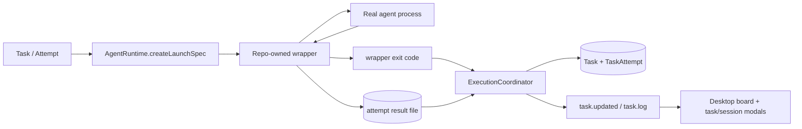

# fix: Restore Runtime State Sync And Harden Desktop Execution Protocol

## Problem Frame
这轮不是重新设计产品，而是在已经交付的 desktop 看板基线之上，修掉两类仍然破坏可信度的运行时问题。

第一类是执行真相仍不可靠。任务可能在日志里看起来已经完成，但 task 仍停在 `executing`，current attempt 仍停在 `running / plan`。`abort` 也可能只是点亮了按钮，却没有真正终止底层进程树。这说明当前 runtime 仍然过度依赖 agent stdout marker 和壳层进程退出，缺少一个稳定的 attempt 级结果协议。

第二类是协议边界需要为后续“自定义任务步骤 + 自定义每步 prompt”留出生存空间。未来允许自定义业务步骤，但 runtime 不能把最终成功/失败判定继续绑在 agent 的自然语言输出上。结果协议必须固定在 wrapper 层，业务 prompt 可以变，机器协议不能变。

desktop 的六列表格、创建弹窗、任务详情弹窗、session 二级弹窗已经是既有基线。这轮只补运行正确性和失败可见性，不重新发明 UI 壳。

## Origin and Scope

### Origin Document
- [2026-03-29-runtime-state-sync-and-kanban-desktop-requirements.md](/D:/Code/Projects/tasks-dispatcher/docs/brainstorms/2026-03-29-runtime-state-sync-and-kanban-desktop-requirements.md)

### In Scope
- 引入固定 wrapper 执行边界，替换“只靠 agent stdout marker 猜结果”的最终收口方式
- 为每个 attempt 增加正式结果文件协议，并以 `结果文件有效 + wrapper exit code = 0` 作为成功判定
- 将 `protocol_failure` 纳入 attempt termination reason、事件流和 GUI 展示
- 将 `abort` 改成强一致语义，只有真实 agent 进程树已停止才落 `manually_aborted`
- 让 desktop 在 `protocol_failure` / `manually_aborted` 下继续稳定收敛，并在 `Failed` 列与详情层展示失败原因

### Out of Scope
- 自定义步骤工作流本身
- 步骤级结果协议
- 重新设计 six-column board、Add Task、task/session modal 的基础信息架构
- 拖拽交互、过滤器、多用户能力
- 对 CLI 单独做第二套状态机或数据库直读旁路

## Requirements Trace

| Area | Covered Requirements | Planning Consequence |
| --- | --- | --- |
| Attempt result protocol | R1-R5g | 需要把最终成功/失败判定从 marker-centric 收口改成 wrapper-centric 收口，并让 `ExecutionCoordinator` 成为唯一裁决点 |
| Runtime ownership and convergence | R1-R4, R5f-R5g | 不能新开平行执行架构；必须沿现有 `AgentRuntime -> runner -> coordinator -> DTO` 主干扩展 |
| Failure visibility in desktop | R12, R15a, R17-R20a | `protocol_failure` / `manually_aborted` 仍进 `Failed` 列，但卡片、session 列表和 session 详情需要能看出失败原因 |
| Existing desktop shell baseline | R6-R11, R13-R21 | 视为已完成基线；只在失败原因可见性和 modal 叠加返回路径上补齐，不再重做壳层 |

## Context and Research

### Local Research
- [AgentRuntime.ts](/D:/Code/Projects/tasks-dispatcher/packages/workspace-runtime/src/agents/AgentRuntime.ts) 现在的 launch spec 只有 `command / args / stdinText`，是最自然的 wrapper 接入点。
- [CodexCliRuntime.ts](/D:/Code/Projects/tasks-dispatcher/packages/workspace-runtime/src/agents/CodexCliRuntime.ts) 和 [ClaudeCodeRuntime.ts](/D:/Code/Projects/tasks-dispatcher/packages/workspace-runtime/src/agents/ClaudeCodeRuntime.ts) 目前直接启动真实 agent，没有 wrapper 边界。
- [NodeChildProcessRunner.ts](/D:/Code/Projects/tasks-dispatcher/packages/workspace-runtime/src/agents/NodeChildProcessRunner.ts) 是统一启动点，但不该承担结果协议解释职责；它应该执行 launch spec，而不是推断结果。
- [ExecutionCoordinator.ts](/D:/Code/Projects/tasks-dispatcher/packages/workspace-runtime/src/dispatching/ExecutionCoordinator.ts) 是当前唯一最终 settle 点。新协议的消费和最终裁决必须继续收口在这里。
- [WorkspaceRuntimeService.ts](/D:/Code/Projects/tasks-dispatcher/packages/workspace-runtime/src/server/WorkspaceRuntimeService.ts) 更适合作为 wiring 层，不适合承担 wrapper 结果解析。
- [TaskAttempt.ts](/D:/Code/Projects/tasks-dispatcher/packages/core/src/domain/TaskAttempt.ts) 当前 termination reasons 只有 `process_exit_non_zero`、`signal_terminated`、`startup_failed`、`manually_aborted`，还没有 `protocol_failure`。
- [TaskEvent.ts](/D:/Code/Projects/tasks-dispatcher/packages/core/src/domain/TaskEvent.ts) 当前只有 `execution_failed` 和 `task_aborted` 两种失败类事件。沿当前分层语义，`protocol_failure` 可以先继续走 `execution_failed`，把细分原因放在 attempt termination reason。
- [TaskDtos.ts](/D:/Code/Projects/tasks-dispatcher/packages/core/src/contracts/TaskDtos.ts) 的 detail DTO 已能承载新的 termination reason；summary DTO 目前不能，因此若 board 卡片要显示失败细分原因，需要补 summary 层 failure hint。
- [WorkspacePaths.ts](/D:/Code/Projects/tasks-dispatcher/packages/workspace-runtime/src/bootstrap/WorkspacePaths.ts) 当前只有 logs/runtime metadata 路径；attempt 结果文件需要新增统一路径管理。
- [001_initial_schema.sql](/D:/Code/Projects/tasks-dispatcher/packages/workspace-runtime/src/persistence/migrations/001_initial_schema.sql) 中 `termination_reason` 和 `task_events.type` 都是 `TEXT`，数据库结构本身不阻塞引入 `protocol_failure`，但模型常量、round-trip 测试和事件语义需要补。
- [TaskCard.tsx](/D:/Code/Projects/tasks-dispatcher/apps/desktop/src/renderer/components/TaskCard.tsx)、[TaskSessionList.tsx](/D:/Code/Projects/tasks-dispatcher/apps/desktop/src/renderer/components/TaskSessionList.tsx)、[TaskSessionDetailModal.tsx](/D:/Code/Projects/tasks-dispatcher/apps/desktop/src/renderer/components/TaskSessionDetailModal.tsx) 是 failure reason 可见性的主要前端落点。

### Institutional Learnings
- [single-workspace-runtime-owner-2026-03-29.md](/D:/Code/Projects/tasks-dispatcher/docs/solutions/best-practices/single-workspace-runtime-owner-2026-03-29.md)
  runtime 真相必须继续由共享 runtime owner 提供，不能让 desktop 为了收口结果而直接读 SQLite。
- [task-vs-task-attempt-boundary-2026-03-29.md](/D:/Code/Projects/tasks-dispatcher/docs/solutions/best-practices/task-vs-task-attempt-boundary-2026-03-29.md)
  `protocol_failure` 和 `manually_aborted` 应继续留在 attempt 维度，不能重新污染 task 级模型。
- [windows-codex-process-launch-gotchas-2026-03-29.md](/D:/Code/Projects/tasks-dispatcher/docs/solutions/integration-issues/windows-codex-process-launch-gotchas-2026-03-29.md)
  Windows 下 `cmd.exe -> codex.cmd -> real process` 的包装链说明 `abort` 必须按进程树思路收口，而不能只发一个轻量 kill。

### External Research
- 不做额外外部研究。当前问题由仓内协议边界和现有 runtime 结构决定，本地证据已经足够支撑 planning。

### Planning Implications
- 这次 planning 是对既有 003 计划的 deepening，不是新主题。desktop 壳层视为已完成基线，新增实现单元集中在执行协议和失败可见性。
- `TASKS_DISPATCHER_STAGE:*` marker 仍可保留为阶段观测信号，但不再承担 attempt 最终成败判定。
- 最终成功 contract 现在是三层分工：
  - wrapper 负责生成正式结果文件并以退出码结束
  - runtime 负责读取结果文件并裁决最终状态
  - agent 只负责执行业务内容，不对最终状态拥有裁决权

## Execution Posture
- Characterization-first。先补当前 `executing` 卡死、`abort` 无效、failure reason 不可见的回归测试，再动协议和进程控制代码。
- Runtime 先于 desktop。先把 wrapper 协议、attempt termination reason 和 abort 收口定住，再补 GUI 失败原因展示。
- 这轮适合 external-delegate 执行：runtime、core、desktop 三块可以拆成边界清晰的实现单元并行落地，再在主线程做集成验证。

## Key Technical Decisions

### 1. Move final attempt truth to a wrapper-owned result protocol
- Decision: runtime 与真实 agent 之间新增固定 wrapper 层。成功必须同时满足“当前 attempt 的正式结果文件有效”与“wrapper 以 `exit code = 0` 退出”。
- Rationale: 这把未来自定义步骤/prompt 与运行时机器协议解耦。agent 可以换业务内容，但 runtime 只信 wrapper 提交的机器结果。
- Alternatives considered:
  - 继续依赖 agent stdout marker 或自然语言总结：未来 prompt 可配置后会漂。
  - 只看 `exit code`：壳层进程和真实 agent 的语义过粗，且 Windows 包装链会污染结果。

### 2. Reuse the existing startup chain instead of adding a parallel executor
- Decision: wrapper 沿现有启动链接入。`AgentRuntime.createLaunchSpec()` 负责产出 wrapper 启动规格；`NodeChildProcessRunner` 只负责执行；`ExecutionCoordinator` 在 wrapper 退出后结合结果文件与退出码裁决。
- Rationale: 这是最小改动路径，也符合 shared runtime owner 原则。`WorkspaceRuntimeService` 继续做 wiring，不承担协议解释。

### 3. Treat `protocol_failure` as a first-class attempt termination reason
- Decision: 在 [TaskAttempt.ts](/D:/Code/Projects/tasks-dispatcher/packages/core/src/domain/TaskAttempt.ts) 中新增 `protocol_failure` termination reason；task 仍落 `execution_failed`；事件层本轮继续使用既有 `execution_failed`，不新增独立 event type。
- Rationale: 这样能最小代价把“协议失败”和“普通进程失败”分开存储与展示，同时避免为了一个细分失败原因扩散出整条新事件模型。
- Alternatives considered:
  - 只在日志中描述 `protocol_failure`：UI 和历史记录无法稳定消费。
  - 同时新增 `execution_protocol_failed` event type：语义更细，但对当前交付价值不成比例。

### 4. Keep abort strong-consistent and process-tree based
- Decision: `abort` 成功的定义是“wrapper 确认真实 agent 进程树已停止”；只有此时 attempt 才能被标记为 `manually_aborted`。
- Rationale: 当前 Windows 包装链下，只 kill 壳层进程并不可靠。若先写状态再事后清理，会再次制造 UI 与真实执行脱节。

### 5. Keep the six-column board and surface failure reason as metadata
- Decision: `protocol_failure` 和 `manually_aborted` 仍落 `Failed` 列；通过卡片摘要、session 列表摘要和 session 详情中的 termination reason 展示细分原因，不新增第七列。
- Rationale: 六列看板是已定产品约束，失败细分应该以原因标签体现，而不是改变主信息架构。

### 6. Preserve stacked modal navigation
- Decision: session detail 继续叠加在 task detail 之上；关闭后回到原 session 列表位置与上下文。
- Rationale: 这已经在 requirements 中定死，计划只需把 failure reason 展示和日志滚动接入这条既有路径。

## High-Level Technical Design

This design is illustrative. It communicates the intended boundaries and result flow, not implementation code.



### Runtime Result Contract
- Stage markers remain observational: they may continue to drive `plan / develop / self_check`.
- Final outcome is no longer marker-driven.
- `ExecutionCoordinator` should treat outcomes like this:

| Wrapper exit | Result file | Runtime outcome |
| --- | --- | --- |
| `0` | valid | success -> `pending_validation` |
| `0` | missing / invalid | `protocol_failure` -> `execution_failed` |
| non-zero | any | process failure -> `execution_failed` |
| aborted by runtime | any | `manually_aborted` after process tree stop |

### Result Artifact Direction
This path is directional guidance for planning, not implementation code.

```text
.tasks-dispatcher/runtime/results/<task-id>/<attempt-id>.json
```

- Wrapper writes a temporary artifact, validates it, then atomically promotes it to the final result path.
- Runtime reads only the final path after wrapper exit.
- Logs remain in `.tasks-dispatcher/logs/<task-id>/<attempt-id>.log`.

## Completed Baseline Units

### [x] Unit A: Ship baseline runtime settle hardening

**Outcome**
- `TASKS_DISPATCHER_STAGE:complete` became a recognized signal
- desktop gained refresh convergence instead of relying only on restart
- missing log reads stopped crashing the runtime server

**Primary files**
- `packages/workspace-runtime/src/dispatching/AgentProcessSupervisor.ts`
- `packages/workspace-runtime/src/dispatching/ExecutionCoordinator.ts`
- `packages/workspace-runtime/src/server/WorkspaceServer.ts`
- `packages/workspace-runtime/tests/dispatching/ExecutionCoordinator.test.ts`

### [x] Unit B: Ship board-first desktop shell

**Outcome**
- six fixed kanban columns
- Add Task modal
- task detail modal
- session detail modal with collapsible log area

**Primary files**
- `apps/desktop/src/renderer/pages/TaskBoardPage.tsx`
- `apps/desktop/src/renderer/components/TaskBoardColumn.tsx`
- `apps/desktop/src/renderer/components/TaskCard.tsx`
- `apps/desktop/src/renderer/components/TaskDetailModal.tsx`
- `apps/desktop/src/renderer/components/TaskSessionDetailModal.tsx`

### [x] Unit C: Lock the desktop-first layout

**Outcome**
- minimum width `1200px`
- horizontal scroll below minimum width
- no mobile-adaptive collapse

**Primary files**
- `apps/desktop/src/renderer/pages/TaskBoardPage.tsx`
- `docs/solutions/best-practices/desktop-app-no-mobile-adaptation-2026-03-30.md`

## New Implementation Units

### [ ] Unit 1: Introduce the wrapper execution result protocol

**Goal**
- 用 repo-owned wrapper 替换“直接启动真实 agent”的最终结果边界，让后续自定义步骤/prompt 也不会破坏 attempt 成败判定。

**Primary files**
- `packages/workspace-runtime/src/agents/AgentRuntime.ts`
- `packages/workspace-runtime/src/agents/CodexCliRuntime.ts`
- `packages/workspace-runtime/src/agents/ClaudeCodeRuntime.ts`
- `packages/workspace-runtime/src/agents/NodeChildProcessRunner.ts`
- `packages/workspace-runtime/src/bootstrap/WorkspacePaths.ts`
- `packages/workspace-runtime/src/agents/wrapper/AgentAttemptWrapper.ts` (new)
- `packages/workspace-runtime/src/persistence/AttemptResultFileStore.ts` (new)

**Patterns to follow**
- 沿用现有 `createLaunchSpec -> child process runner` 主干，不另起 executor。
- 路径管理沿用 [WorkspacePaths.ts](/D:/Code/Projects/tasks-dispatcher/packages/workspace-runtime/src/bootstrap/WorkspacePaths.ts) 的集中式做法。

**Approach**
- 扩展 launch spec 所需元数据，使 runtime 能在创建 launch spec 时就绑定 `taskId`、`attemptId`、结果文件路径和真实 agent 目标。
- 新增 repo-owned wrapper，负责：
  - 启动真实 agent
  - 转发 stdout/stderr 到原有日志链路
  - 写临时结果文件并原子晋升为正式结果文件
  - 对 abort / timeout / child exit 做统一收尾
- `NodeChildProcessRunner` 保持“执行 spec”职责，不解析结果文件。

**Test files**
- `packages/workspace-runtime/tests/agents/AgentAttemptWrapper.test.ts` (new)
- `packages/workspace-runtime/tests/agents/AgentProcessSupervisor.test.ts`
- `packages/workspace-runtime/tests/bootstrap/WorkspacePaths.test.ts` (new)

**Test scenarios**
- wrapper 能启动 codex/claude 的真实 launch target，并把原始 stdout/stderr 继续透传
- wrapper 写正式结果文件前会先完成临时文件与校验，不会留下半成品 final artifact
- wrapper 异常退出时不会伪造成功结果文件
- Windows 下 codex 包装链仍能正确传参，不重新引入 `cmd.exe / codex.cmd` 分裂问题

**Verification**
- launch spec、workspace paths、wrapper result artifact 都有独立测试锁住，执行协议不再依赖 prompt 文本约定

### [ ] Unit 2: Refactor execution settle to read wrapper results

**Goal**
- 把 attempt 最终成败判定从“close + marker”升级为“wrapper exit + result artifact”，并让 `protocol_failure` 成为 first-class termination reason。

**Primary files**
- `packages/core/src/domain/TaskAttempt.ts`
- `packages/core/src/domain/Task.ts`
- `packages/core/src/domain/TaskEvent.ts`
- `packages/core/src/contracts/TaskDtos.ts`
- `packages/workspace-runtime/src/dispatching/ExecutionCoordinator.ts`
- `packages/workspace-runtime/src/server/WorkspaceRuntimeService.ts`
- `packages/workspace-runtime/src/persistence/SqliteTaskRepository.ts`
- `packages/workspace-runtime/src/persistence/SqliteTaskEventStore.ts`

**Patterns to follow**
- 延续 [Task.ts](/D:/Code/Projects/tasks-dispatcher/packages/core/src/domain/Task.ts) 中“task state 与 attempt lifecycle 分离”的领域边界。
- 继续让 `ExecutionCoordinator` 成为唯一最终 settle 点，而不是把结果解释散落到 service 或 renderer。

**Approach**
- 在 attempt termination reasons 中新增 `protocol_failure`。
- 保持 event layer 的最小改动：
  - `manually_aborted` 继续通过 `task_aborted` 体现动作
  - `protocol_failure` 继续走 `execution_failed` event
- 在 `ExecutionCoordinator` 中引入明确的 settle 矩阵：
  - valid result + exit 0 => `markAwaitingValidation`
  - invalid/missing result + exit 0 => `markExecutionFailed("protocol_failure")`
  - non-zero exit => 既有失败原因
- 清理 `stageUpdateQueue` 和 settle 之间的耦合，确保 stage 更新异常不能阻塞最终 settle。

**Test files**
- `packages/core/tests/domain/TaskAttempt.test.ts`
- `packages/core/tests/application/TaskLifecycleServices.test.ts`
- `packages/workspace-runtime/tests/dispatching/ExecutionCoordinator.test.ts`
- `packages/workspace-runtime/tests/persistence/SqliteTaskRepository.test.ts`

**Test scenarios**
- valid result artifact + exit 0 => task `pending_validation`, attempt `completed`
- exit 0 + missing result => task `execution_failed`, attempt `failed/protocol_failure`
- exit 0 + corrupt result => task `execution_failed`, attempt `failed/protocol_failure`
- non-zero exit + any artifact => task `execution_failed`, attempt 继续保留进程级失败原因
- `protocol_failure` 和 `manually_aborted` 都能在 repository round-trip 后保持不变

**Verification**
- runtime 测试能稳定证明 success / process failure / protocol failure 三种终态被清晰区分

### [ ] Unit 3: Make abort strongly consistent across wrapper and process tree

**Goal**
- 让 `abort` 真正终止底层执行，而不是只更新按钮状态或只杀壳层进程。

**Primary files**
- `packages/workspace-runtime/src/dispatching/AgentProcessSupervisor.ts`
- `packages/workspace-runtime/src/dispatching/ExecutionCoordinator.ts`
- `packages/workspace-runtime/src/agents/NodeChildProcessRunner.ts`
- `packages/workspace-runtime/src/agents/wrapper/AgentAttemptWrapper.ts` (new)
- `packages/workspace-runtime/src/server/WorkspaceRuntimeService.ts`

**Patterns to follow**
- 维持 runtime 主导的中止流程，不允许 desktop 或 CLI 直接越过 runtime 杀本地进程。
- 参考 [windows-codex-process-launch-gotchas-2026-03-29.md](/D:/Code/Projects/tasks-dispatcher/docs/solutions/integration-issues/windows-codex-process-launch-gotchas-2026-03-29.md) 的 Windows 保守收口原则。

**Approach**
- wrapper 负责维护真实 child process 引用与进程树终止逻辑。
- `ExecutionCoordinator.abortTask()` 不再把“已请求 abort”视为成功，而是等待 wrapper 返回“已停止”事实后再 settle。
- `WorkspaceRuntimeService.abortTask()` 避免 broad catch 吞掉真实中止失败。
- 为 Windows 定义明确的进程树终止路径，确保 codex/claude 的壳层与真实执行体一起退出。

**Test files**
- `packages/workspace-runtime/tests/dispatching/ExecutionCoordinator.test.ts`
- `packages/workspace-runtime/tests/agents/AgentAttemptWrapper.test.ts` (new)
- `packages/workspace-runtime/tests/server/WorkspaceRuntimeService.test.ts` (new)

**Test scenarios**
- 运行中的 attempt 点击 abort 后，只有在 wrapper 确认 child process tree 已退出时才返回 `manually_aborted`
- abort 失败时不会把 task 错标为 `manually_aborted`
- Windows/cmd 包装链下，abort 不会只杀 `cmd.exe` 而留下真实 agent
- abort 后 board / detail DTO 都会收敛到 `execution_failed + manually_aborted`

**Verification**
- end-to-end runtime 测试能证明 abort 结果与真实进程停止事实一致

### [ ] Unit 4: Surface failure reasons through DTOs and desktop UI

**Goal**
- 保持 six-column board 不变，同时让 `protocol_failure` / `manually_aborted` 在 `Failed` 列与详情层可见。

**Primary files**
- `packages/core/src/contracts/TaskDtos.ts`
- `packages/core/src/contracts/WorkspaceRuntimeApi.ts`
- `apps/desktop/src/renderer/board/boardModel.ts`
- `apps/desktop/src/renderer/components/TaskCard.tsx`
- `apps/desktop/src/renderer/components/TaskDetailModal.tsx`
- `apps/desktop/src/renderer/components/TaskSessionList.tsx`
- `apps/desktop/src/renderer/components/TaskSessionDetailModal.tsx`
- `apps/desktop/src/renderer/pages/TaskBoardPage.tsx`

**Patterns to follow**
- 继续维持 `Failed` 单列，不把细分失败原因升格为新列。
- 让 failure reason 成为 metadata，而不是新的 UI 状态机。

**Approach**
- 给 summary 或 board 所需数据补一个最小 failure hint，避免卡片层为了显示原因必须额外拉 detail。
- session 列表至少能看出该 session 的 `terminationReason` 摘要。
- session 详情继续作为 failure reason 最完整的展示层。
- `TaskBoardPage` 保持 task detail -> session detail 的叠加 modal 返回路径，不因为失败原因展示破坏上下文恢复。

**Test files**
- `apps/desktop/src/renderer/__tests__/TaskCard.test.tsx`
- `apps/desktop/src/renderer/__tests__/TaskDetailModal.test.tsx`
- `apps/desktop/src/renderer/__tests__/TaskSessionList.test.tsx` (new)
- `apps/desktop/src/renderer/__tests__/TaskSessionDetailModal.test.tsx`
- `apps/desktop/src/renderer/__tests__/TaskBoardPage.test.tsx`

**Test scenarios**
- `execution_failed + protocol_failure` 显示在 `Failed` 列，并带明确原因标签
- `execution_failed + manually_aborted` 显示在 `Failed` 列，并与普通失败可区分
- task detail 中打开某个失败 session 后，session detail 关闭会回到原列表上下文
- board 不会因为 failure reason 展示而打破 desktop-first 六列结构

**Verification**
- desktop 组件测试能证明 failure reason 在 board / detail / session 三层都可见且不破坏现有信息架构

### [ ] Unit 5: Rebuild regression coverage around the new protocol

**Goal**
- 让后续实现自定义步骤/prompt 前，attempt 级协议、abort 和 desktop failure visibility 都有稳定回归保护。

**Primary files**
- `packages/workspace-runtime/tests/dispatching/ExecutionCoordinator.test.ts`
- `packages/workspace-runtime/tests/agents/AgentProcessSupervisor.test.ts`
- `packages/workspace-runtime/tests/agents/AgentAttemptWrapper.test.ts` (new)
- `packages/workspace-runtime/tests/server/WorkspaceRuntimeService.test.ts` (new)
- `apps/desktop/src/main/__tests__/desktopStartupSmoke.test.ts`
- `apps/desktop/src/renderer/__tests__/TaskBoardPage.test.tsx`

**Patterns to follow**
- 对 runtime 使用 characterization-style 覆盖，先锁当前 bug，再锁未来协议约束。
- 对 desktop 继续使用组件测试 + 一条 smoke，而不是用重型端到端覆盖全部交互。

**Approach**
- 为 success / protocol_failure / manually_aborted 三条主线各补一组最短闭环测试。
- desktop smoke 补一条“queue -> running -> abort / protocol failure -> failed reason visible”的链路。
- 保持已有 board UI smoke，不把本轮 failure visibility 变成新的视觉回归大工程。

**Test files**
- 同上

**Test scenarios**
- queue 后 valid result 收敛到 `pending_validation`
- queue 后 invalid result 收敛到 `execution_failed/protocol_failure`
- queue 后 abort 收敛到 `execution_failed/manually_aborted`
- 打开的 detail/session modal 会看到最终 termination reason

**Verification**
- implementer 能靠测试先验证 runtime truth，再验证 desktop convergence 和 failure visibility

## System-Wide Impact
- runtime execution contract 从 marker-centric 变成 wrapper-centric，会影响 codex 和 claude 两条 launch path。
- `protocol_failure` 会扩散到 core domain constants、DTO、runtime persistence round-trip、desktop failure presentation。
- workspace state 目录会新增 attempt result artifact，需与现有 runtime/logs 目录并存且可清理。
- desktop board 不改列模型，但 summary DTO 和 session 展示层会增加 failure reason 可见性。

## Risks and Dependencies

### Primary Risks
- wrapper 如果设计成第二套执行系统，会让 runtime wiring 和启动链分裂。
- 结果文件如果没有原子提交语义，`exit 0` 时仍可能读到半写入结果并误判 `protocol_failure`。
- abort 若继续只杀壳层，会让 `manually_aborted` 成为假象。
- 把 failure reason 过度抬高到卡片主视觉，可能破坏现有 board 的信息密度。

### Mitigations
- 把 wrapper 接入点钉死在 `AgentRuntime.createLaunchSpec()`，而不是另建 executor。
- 用 temp -> validate -> atomic promote 的结果文件策略；runtime 只读 final path。
- 把 abort 成功定义为进程树已停止事实，而不是“已发送 kill 请求”。
- 让 card 只显示最小 failure hint，把完整上下文留给 task/session detail。

### Dependencies
- `AgentRuntime` 启动链可被扩展为 wrapper spec
- `ExecutionCoordinator` 继续承担最终 settle 权限
- `TaskAttemptTerminationReason` 与 DTO 可以扩充而不破坏 task/attempt 分层
- 既有 board/detail/session modal 组件可以承接 failure reason 展示，而无需重写信息架构

## Open Questions

### Resolved During Planning
- wrapper 沿现有 `AgentRuntime -> runner -> coordinator` 链接入，而不是另起执行架构
- 成功判定采用 `结果文件有效 + wrapper exit code = 0`
- `protocol_failure` 成为正式 attempt termination reason
- `protocol_failure` 本轮继续映射为 `execution_failed` event，而不是新增 event type
- `protocol_failure` / `manually_aborted` 继续落 `Failed` 列，通过原因标签区分
- session detail 继续叠加在 task detail 之上，关闭后回到原上下文

### Deferred to Implementation
- [Affects Unit 1] wrapper 正式结果文件的精确 envelope 字段和校验规则
- [Affects Unit 1, Unit 3] Windows 下 codex/claude 进程树终止的最终实现方式
- [Affects Unit 4] summary DTO 的 failure hint 采用显式字段还是重用当前 attempt 摘要
- [Affects Unit 4] session detail 叠加层最终使用现有 modal 组件还是受控 overlay state

## Sources and References
- Origin requirements: [2026-03-29-runtime-state-sync-and-kanban-desktop-requirements.md](/D:/Code/Projects/tasks-dispatcher/docs/brainstorms/2026-03-29-runtime-state-sync-and-kanban-desktop-requirements.md)
- Existing baseline plan: [2026-03-29-001-feat-agent-task-board-mvp-plan.md](/D:/Code/Projects/tasks-dispatcher/docs/plans/2026-03-29-001-feat-agent-task-board-mvp-plan.md)
- Runtime owner learning: [single-workspace-runtime-owner-2026-03-29.md](/D:/Code/Projects/tasks-dispatcher/docs/solutions/best-practices/single-workspace-runtime-owner-2026-03-29.md)
- Task/attempt boundary learning: [task-vs-task-attempt-boundary-2026-03-29.md](/D:/Code/Projects/tasks-dispatcher/docs/solutions/best-practices/task-vs-task-attempt-boundary-2026-03-29.md)
- Windows launch learning: [windows-codex-process-launch-gotchas-2026-03-29.md](/D:/Code/Projects/tasks-dispatcher/docs/solutions/integration-issues/windows-codex-process-launch-gotchas-2026-03-29.md)
- Runtime launch spec boundary: [AgentRuntime.ts](/D:/Code/Projects/tasks-dispatcher/packages/workspace-runtime/src/agents/AgentRuntime.ts)
- Runtime settle path: [ExecutionCoordinator.ts](/D:/Code/Projects/tasks-dispatcher/packages/workspace-runtime/src/dispatching/ExecutionCoordinator.ts)
- Attempt domain model: [TaskAttempt.ts](/D:/Code/Projects/tasks-dispatcher/packages/core/src/domain/TaskAttempt.ts)
- Desktop session detail UI: [TaskSessionDetailModal.tsx](/D:/Code/Projects/tasks-dispatcher/apps/desktop/src/renderer/components/TaskSessionDetailModal.tsx)

## Recommended Execution Order
1. Unit 1
2. Unit 2
3. Unit 3
4. Unit 4
5. Unit 5

## Implementation Readiness Check
- planning 已把 “wrapper 放哪一层、谁判结果、`protocol_failure` 落哪层语义、abort 何时算成功” 全部定清，`ce:work` 不需要再发明协议边界。
- 文件路径、测试路径和 failure scenarios 已经具体到可以直接拆工。
- 既有 six-column desktop shell 被视为已完成基线，后续实现不会把这轮 bugfix 又拖成一次 UI 大重写。
