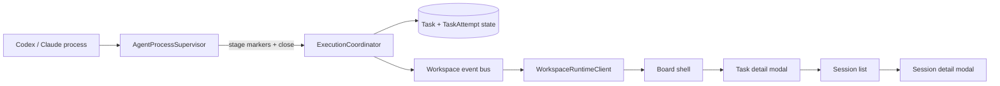

# fix: Restore Runtime State Sync And Redesign Desktop Kanban

## Problem Frame
当前问题分成两层，但必须按顺序处理。

第一层是运行正确性：agent 实际已经执行、日志里甚至能看出“任务完成”，但 task 仍停在 `executing`，current attempt 仍停在 `running / plan`。这会破坏 desktop 与 CLI 对 runtime 真相的信任，也会让后续 GUI 重构建立在错误状态之上。

第二层是 desktop 信息架构：当前主界面同时承载创建表单、任务列表、详情面板和日志区。它更像调试台，不像任务看板。用户已经明确要切成“纯看板主界面 + 创建弹窗 + 任务详情弹窗 + 会话详情弹窗”的结构，并且看板列采用用户视角分组，而不是原始状态直出。

## Origin and Scope

### Origin Document
- [docs/brainstorms/2026-03-29-runtime-state-sync-and-kanban-desktop-requirements.md](D:\Code\Projects\tasks-dispatcher\docs\brainstorms\2026-03-29-runtime-state-sync-and-kanban-desktop-requirements.md)

### In Scope
- runtime 最终状态推进与 attempt stage/status 同步
- 执行结束后的 desktop 刷新与 log 读取韧性
- desktop 主界面重构为用户视角分组看板
- 新建任务弹窗、任务详情弹窗、会话详情弹窗
- 会话列表、日志折叠、独立滚动、列内排序

### Out of Scope
- 拖拽换列、拖拽排序、拖拽手势
- 新 workflow 系统、过滤器系统、多人协作或权限
- CLI UX 改版
- 任务领域状态机业务规则的大改

## Requirements Trace

| Area | Covered Requirements | Planning Consequence |
| --- | --- | --- |
| Execution correctness | R1-R5 | 必须先修 runtime 收口 contract、attempt 同步与 renderer 最终刷新，再动 UI 结构 |
| Board model | R6-R10b, R14-R15, R21 | desktop 需要从单列列表切到固定六列用户态看板，并把卡片交互和排序写死为主界面规则 |
| Detail flows | R11-R13, R16-R20 | 任务详情必须分层：无 attempt 时轻量；有 attempt 时先会话列表，再进二级会话详情弹窗；长日志默认折叠且独立滚动 |

## Context and Research

### Local Research
- [ExecutionCoordinator.ts](/D:/Code/Projects/tasks-dispatcher/packages/workspace-runtime/src/dispatching/ExecutionCoordinator.ts) 现在只在 `supervisor.onExit -> #settleTask()` 时推进最终状态，因此“日志看起来结束了”本身不会改变 task state。
- [AgentPromptFactory.ts](/D:/Code/Projects/tasks-dispatcher/packages/workspace-runtime/src/agents/AgentPromptFactory.ts) 已要求 agent 输出 `TASKS_DISPATCHER_STAGE:complete`，但 [AgentProcessSupervisor.ts](/D:/Code/Projects/tasks-dispatcher/packages/workspace-runtime/src/dispatching/AgentProcessSupervisor.ts) 目前并不消费这个 marker。
- [TaskBoardPage.tsx](/D:/Code/Projects/tasks-dispatcher/apps/desktop/src/renderer/pages/TaskBoardPage.tsx) 当前仍以单个 `selectedTask` + 常驻详情/日志区为中心，不适合直接承载看板、任务弹窗和会话二级弹窗。
- [TaskList.tsx](/D:/Code/Projects/tasks-dispatcher/apps/desktop/src/renderer/components/TaskList.tsx) 当前是单列列表；[TaskComposer.tsx](/D:/Code/Projects/tasks-dispatcher/apps/desktop/src/renderer/components/TaskComposer.tsx) 当前是常驻表单；[TaskDetailPane.tsx](/D:/Code/Projects/tasks-dispatcher/apps/desktop/src/renderer/components/TaskDetailPane.tsx) 与 [TaskLogStream.tsx](/D:/Code/Projects/tasks-dispatcher/apps/desktop/src/renderer/components/TaskLogStream.tsx) 当前是页面常驻信息块。
- [TaskStatusActions.tsx](/D:/Code/Projects/tasks-dispatcher/apps/desktop/src/renderer/components/TaskStatusActions.tsx) 已经收口了按状态显示按钮的逻辑，是这次 desktop 重构里最值得复用的组件之一。
- [ExecutionCoordinator.test.ts](/D:/Code/Projects/tasks-dispatcher/packages/workspace-runtime/tests/dispatching/ExecutionCoordinator.test.ts) 已覆盖“fake 脚本正常退出 -> `pending_validation`”，但还没覆盖“complete marker 可见、进程未及时关闭、stage marker 不完整、renderer 最终刷新”这些更接近真实 CLI 的情况。

### Institutional Learnings
- [single-workspace-runtime-owner-2026-03-29.md](D:\Code\Projects\tasks-dispatcher\docs\solutions\best-practices\single-workspace-runtime-owner-2026-03-29.md) 要求 CLI 与 desktop 都通过同一个 workspace runtime owner 访问状态；修复状态同步不能把 desktop 变成直接读写 SQLite 的特例。
- [windows-codex-process-launch-gotchas-2026-03-29.md](D:\Code\Projects\tasks-dispatcher\docs\solutions\integration-issues\windows-codex-process-launch-gotchas-2026-03-29.md) 说明 Codex 在 Windows 上的进程收口要格外保守，任何执行完成判定都不能重新引入脆弱的 shell 启动或 prompt split 行为。

### External Research
- 不做额外外部研究。当前问题集中在仓内 runtime contract 与 desktop 信息架构，并且本地模式和现有实现已经给了足够约束。

### Planning Implications
- 这次工作应拆成“Phase 1 运行正确性”和“Phase 2 desktop 重构”两个连续但边界清晰的实现段。
- 对 Phase 1，执行完成判定需要采用混合策略：进程退出仍是最终 truth source 之一，但 `TASKS_DISPATCHER_STAGE:complete` 不应继续被忽略。
- 对 Phase 2，当前页面编排基本需要重写，但任务动作逻辑、DTO 形状和一部分展示组件可以复用。

## Execution Posture
- Characterization-first for Phase 1。先补“状态不同步”的回归测试，再改 runtime 收口逻辑。
- Phase 2 再进入 UI 重构。不要在修 runtime 真相前开始看板界面重排。
- 对 UI 单元采用组件测试 + 一条 desktop smoke 验证，不把全部交互都塞进一个超重端到端测试。

## Key Technical Decisions

### 1. Use a mixed completion contract for agent executions
- Decision: `process close` 继续是最终 settle 的核心信号，但 `TASKS_DISPATCHER_STAGE:complete` 必须进入 supervisor / coordinator 的状态机，作为“agent 明确声明已完成”的辅助收口信号。
- Rationale: 当前 prompt 已要求输出 `complete` marker，但 runtime 没消费它，等于约定存在却无效。只相信 UI 看到的长日志显然不够；只相信进程关闭也会让“完成已声明但进程未及时退出”的情况长期卡住。
- Alternatives considered:
  - 完全改成看到 `complete` marker 就直接 `pending_validation`：风险太高，可能把还没真正结束的进程当成完成。
  - 继续只依赖 `close`：无法解释当前“日志看起来已结束但状态不推进”的体验问题。

### 2. Keep state truth in runtime, not renderer
- Decision: task state、attempt status、attempt stage 仍由 runtime 层统一写入并广播；renderer 只做最终刷新兜底，不猜状态。
- Rationale: 这符合现有 single-runtime-owner 模式，也避免 desktop 和 CLI 分裂出两套“完成”逻辑。

### 3. Rebuild the desktop around a board-first shell
- Decision: `TaskBoardPage` 改成“header + add-task button + six-column board”，移除常驻创建表单、常驻详情区、常驻日志区。
- Rationale: 用户已经明确要求主界面只看到看板，不再承载过多细节。当前结构如果继续打补丁，最终会更乱。

### 4. Layer task details by execution history
- Decision: 任务详情分两层：
  - 任务详情弹窗：基础信息 + 状态动作 + session 列表
  - 会话详情弹窗：单个 session 的状态、阶段、历史 log、实时 log
- Rationale: 这能把“无 attempt 的轻量任务”和“有多次执行历史的复杂任务”分开处理，避免一个弹窗承担所有信息。

## High-Level Technical Design

This diagram is illustrative. It shows runtime truth flow and desktop information flow, not implementation code.

### Runtime Truth Model
- final task state is written in runtime only
- `complete` marker becomes a recognized execution signal, but does not bypass runtime ownership
- renderer consumes runtime events and uses targeted refetch to converge on final state

### Desktop Information Model
- Board shell shows grouped human-facing columns only
- Task card shows only the minimal summary plus direct actions
- Task modal shows task-level details and session list
- Session modal shows one attempt/session deeply, with collapsible log area

## Implementation Units

### [x] Unit 1: Harden execution settle signals and attempt synchronization

**Goal**
- 让 runtime 在真实执行结束后稳定推进 task 与 current attempt，不再长期卡在 `executing / running / plan`。

**Primary files**
- `packages/workspace-runtime/src/dispatching/AgentProcessSupervisor.ts`
- `packages/workspace-runtime/src/dispatching/ExecutionCoordinator.ts`
- `packages/workspace-runtime/src/agents/AgentPromptFactory.ts`
- `packages/workspace-runtime/src/server/WorkspaceRuntimeService.ts`
- `packages/workspace-runtime/src/server/TaskEventStream.ts`

**Patterns to follow**
- 复用 [ExecutionCoordinator.ts](/D:/Code/Projects/tasks-dispatcher/packages/workspace-runtime/src/dispatching/ExecutionCoordinator.ts) 现有“runtime 真相源”边界，不把最终状态推进移到 renderer。
- 保持 [Task.ts](/D:/Code/Projects/tasks-dispatcher/packages/core/src/domain/Task.ts) 和 [TaskAttempt.ts](/D:/Code/Projects/tasks-dispatcher/packages/core/src/domain/TaskAttempt.ts) 的领域约束为最终规则源。

**Approach**
- 让 supervisor 识别 `TASKS_DISPATCHER_STAGE:complete`，并把它作为显式执行完成信号纳入内部事件模型。
- 在 coordinator 中定义清晰的 settle 策略：
  - stage markers 驱动 `plan / develop / self_check`
  - `complete` marker 表示 agent 已声明完成
  - `close` 仍是进程生命周期的最终确认点
- 对“已声明完成但 close 延迟”给出明确收口策略，避免状态永久卡住。
- 保持 Windows `codex` 启动路径与现有 `cmd.exe /d /s /c` 兼容。

**Test files**
- `packages/workspace-runtime/tests/dispatching/ExecutionCoordinator.test.ts`
- `packages/workspace-runtime/tests/agents/AgentProcessSupervisor.test.ts`
- `packages/workspace-runtime/tests/server/RuntimeLauncher.test.ts`

**Test scenarios**
- fake agent 输出完整 `plan -> develop -> self_check -> complete` 且正常退出时，task 进入 `pending_validation`，attempt 进入 `completed/self_check`
- fake agent 缺少中间 stage marker，但输出 `complete` 并退出时，最终状态仍能正确 settle
- fake agent 输出 `complete` 后延迟关闭时，task 不会永久卡在 `executing`
- 非零退出、signal 终止、startup failure 仍正确落到 `execution_failed`

**Verification**
- workspace-runtime 针对 execution/supervisor 的测试能稳定证明最终状态推进不再依赖手工刷新

### [x] Unit 2: Make desktop refresh converge on runtime truth after executions settle

**Goal**
- 即使流式事件有抖动，desktop 也能在执行结束后自动收敛到最终 task/attempt 状态。

**Primary files**
- `apps/desktop/src/renderer/pages/TaskBoardPage.tsx`
- `apps/desktop/src/preload/taskBoardApi.ts`
- `apps/desktop/src/main/ipc/taskIpcHandlers.ts`
- `packages/core/src/contracts/TaskDtos.ts`

**Patterns to follow**
- 延续 [TaskBoardPage.tsx](/D:/Code/Projects/tasks-dispatcher/apps/desktop/src/renderer/pages/TaskBoardPage.tsx) 现有 event + refetch 混合模式，但把它从“选中任务详情页思路”改成“board + modal”思路。

**Approach**
- 把执行中的最终刷新从“只刷新 selected task”提升为“board item summary + active modal detail”的统一收敛路径。
- 明确区分：
  - summary list refresh
  - selected task detail refresh
  - selected session log refresh
- 确保读取空日志或还没生成的日志不会破坏 runtime 或把整个 desktop 打进 startup error state。
- 如果 DTO 不足以支撑 session 列表排序和展示，在这里补 DTO 而不是让 renderer 拼接隐式语义。

**Test files**
- `apps/desktop/src/renderer/__tests__/TaskBoardPage.test.tsx`
- `apps/desktop/src/main/__tests__/taskIpcHandlers.test.ts`
- `apps/desktop/src/main/__tests__/desktopStartupSmoke.test.ts`

**Test scenarios**
- 当运行中的任务收到最终 settle 后，desktop summary 会更新到 `pending_validation` 或 `execution_failed`
- attempt status/stage 变化后，打开中的详情视图会看到最终值
- 读取缺失日志返回空串，不会把页面打成 startup error
- desktop smoke 中 create -> queue -> wait 后，状态会从 `executing` 收敛到真实最终态或真实执行中态，而不是永久陈旧

**Verification**
- desktop smoke 能证明“执行完成后 UI 自动推进”，不是仅靠重新打开应用才恢复

### [x] Unit 3: Replace the current desktop shell with a board-first layout

**Goal**
- 把主界面从“表单+列表+详情+日志”改成纯看板壳。

**Primary files**
- `apps/desktop/src/renderer/App.tsx`
- `apps/desktop/src/renderer/pages/TaskBoardPage.tsx`
- `apps/desktop/src/renderer/components/TaskList.tsx`
- `apps/desktop/src/renderer/components/TaskBoardColumn.tsx`
- `apps/desktop/src/renderer/components/TaskCard.tsx`
- `apps/desktop/src/renderer/components/TaskStatusActions.tsx`

**Patterns to follow**
- 保留 [TaskStatusActions.tsx](/D:/Code/Projects/tasks-dispatcher/apps/desktop/src/renderer/components/TaskStatusActions.tsx) 的状态按钮规则，重用其行为边界。

**Approach**
- 把现有 `TaskList` 替换成按 `Draft / Ready / Running / Review / Failed / Archived` 分列的 board。
- 列内排序固定用 `updatedAt` 倒序。
- 卡片只展示：标题、三行描述摘要、状态、详情按钮、直接状态操作按钮。
- 卡片主体不绑定详情打开，避免误触并为后续拖拽保留空间。
- 主界面只保留 header、`Add Task` 按钮和 board，不再常驻详情/日志区。

**Test files**
- `apps/desktop/src/renderer/__tests__/TaskBoardPage.test.tsx`
- `apps/desktop/src/renderer/__tests__/TaskStatusActions.test.tsx`
- `apps/desktop/src/renderer/__tests__/TaskCard.test.tsx`

**Test scenarios**
- board 会把原始状态稳定映射到六个用户态列
- 列内卡片按最近更新倒序排列
- 卡片主体不会打开详情，只有 `Details` 按钮会
- 卡片展示的状态操作按钮与 task state 一致

**Verification**
- 打开 desktop 后，主界面只出现 board shell 和 `Add Task`，不再出现常驻表单/详情/日志

### [x] Unit 4: Move task creation into a modal workflow

**Goal**
- 保留现有任务创建字段，但把入口改成右上角按钮 + 弹窗。

**Primary files**
- `apps/desktop/src/renderer/components/TaskComposer.tsx`
- `apps/desktop/src/renderer/components/CreateTaskModal.tsx`
- `apps/desktop/src/renderer/pages/TaskBoardPage.tsx`

**Patterns to follow**
- 复用 [TaskComposer.tsx](/D:/Code/Projects/tasks-dispatcher/apps/desktop/src/renderer/components/TaskComposer.tsx) 现有字段、默认 agent 和提交逻辑，不重复发明表单 contract。

**Approach**
- 把当前 `TaskComposer` 从页面块重包成 modal 内容。
- header 右上角只保留 `Add Task` 按钮。
- 创建成功后关闭 modal，并让新任务在对应列里浮到前面。

**Test files**
- `apps/desktop/src/renderer/__tests__/CreateTaskModal.test.tsx`
- `apps/desktop/src/renderer/__tests__/TaskBoardPage.test.tsx`

**Test scenarios**
- 点击 `Add Task` 打开 modal
- 创建成功后 modal 关闭，新任务出现在 `Draft` 列顶部
- 创建失败时 modal 保持打开并展示错误

**Verification**
- desktop 主界面不再常驻创建表单

### [x] Unit 5: Split task detail and session detail into two modal layers

**Goal**
- 让“轻量任务详情”和“深度会话详情”分层展示，避免一个弹窗承载所有历史与日志。

**Primary files**
- `apps/desktop/src/renderer/components/TaskDetailPane.tsx`
- `apps/desktop/src/renderer/components/TaskLogStream.tsx`
- `apps/desktop/src/renderer/components/TaskDetailModal.tsx`
- `apps/desktop/src/renderer/components/TaskSessionList.tsx`
- `apps/desktop/src/renderer/components/TaskSessionDetailModal.tsx`
- `apps/desktop/src/renderer/pages/TaskBoardPage.tsx`

**Patterns to follow**
- 延续 [TaskDetailPane.tsx](/D:/Code/Projects/tasks-dispatcher/apps/desktop/src/renderer/components/TaskDetailPane.tsx) 中基础信息与 `TaskStatusActions` 的展示语义，但改成 modal-first。
- 复用 [TaskLogStream.tsx](/D:/Code/Projects/tasks-dispatcher/apps/desktop/src/renderer/components/TaskLogStream.tsx) 的日志容器思路，但改成折叠式、可滚动的 session-level log viewer。

**Approach**
- 任务尚无 attempt 时，任务详情 modal 只展示：标题、完整描述、状态、工作流、状态操作。
- 任务已有 attempt 时，任务详情 modal 额外展示 session 列表，每条 session 带 `Details` 按钮。
- 会话详情 modal 展示单个 session 的：
  - 会话 ID
  - status / stage / terminationReason
  - 历史日志
  - 实时日志
- 日志默认折叠，展开后使用独立滚动区域；会话 modal 宽度比任务详情 modal 更宽。

**Test files**
- `apps/desktop/src/renderer/__tests__/TaskDetailModal.test.tsx`
- `apps/desktop/src/renderer/__tests__/TaskSessionDetailModal.test.tsx`
- `apps/desktop/src/renderer/__tests__/TaskLogStream.test.tsx`

**Test scenarios**
- 无 attempt 的任务详情 modal 不展示 session 列表或日志区
- 有 attempt 的任务详情 modal 展示 session 列表，每条 session 可进入二级详情 modal
- 会话详情 modal 中日志默认折叠；展开后日志容器独立滚动
- 多 attempt 时能清晰区分不同 session，而不是把日志混成一段

**Verification**
- 一个任务存在多个 attempt 时，主界面仍保持干净，深度信息只在二级 modal 出现

## System-Wide Impact
- runtime completion contract 会更明确，减少“日志看起来结束但状态没落地”的灰区。
- desktop 页面状态会从“selected task + side pane”转成“board shell + modal stack”，这会影响 renderer 的状态管理方式。
- DTO 可能需要增加更明确的会话展示信息，但不应破坏 CLI 与 runtime 的共享 contract。

## Risks and Dependencies

### Primary Risks
- 如果把 `complete` marker 当成唯一 truth source，可能把未真正结束的 agent 误判为完成。
- 如果 desktop summary 和 modal detail 各自维护状态，可能出现看板已更新但弹窗仍旧旧值的分裂。
- 如果会话详情把所有日志一次性展开，modal 很容易重新变成信息垃圾场。
- 如果按原始状态直接映射进 UI 组件，会让用户态列模型再次泄露实现细节。

### Mitigations
- 用“complete marker + close + final refetch”混合策略，而不是单一信号。
- Board summary 和 modal detail 都从 runtime DTO 拉取，不在 renderer 里发明影子状态机。
- 会话详情日志默认折叠且独立滚动，避免 modal 尺寸被日志撑爆。
- 把用户态列映射收口在一个明确的 board mapping helper 中，并用测试锁住。

### Dependencies
- 现有 `Task / TaskAttempt / TaskStateMachine` 领域模型继续作为状态规则源
- `TaskStatusActions` 可复用为卡片与 modal 的统一状态操作入口
- 现有 desktop smoke 基础可继续扩展，用于验证 create -> queue -> settle 的完整链路

## Open Questions

### Resolved During Planning
- 列模型采用用户视角分组，而不是原始状态直出
- 卡片主体不打开详情，`Details` 按钮才打开
- 对已有 attempt 的任务，先 session 列表，再二级会话详情 modal
- 日志默认折叠且独立滚动
- 同列卡片按最近更新优先排序

### Deferred to Implementation
- [Affects Unit 1] Codex/Claude 的真实 `complete` marker 输出是否稳定到足以作为“声明完成”信号，需要在实现时用本机真实 CLI 再校验一次，但不改变 mixed completion contract 结论。
- [Affects Unit 5] 二级 session modal 更适合用原生 dialog 还是受控 modal state，需要实现时结合现有 daisyUI 行为和可测试性定案。

## Sources and References
- Origin requirements: [docs/brainstorms/2026-03-29-runtime-state-sync-and-kanban-desktop-requirements.md](D:\Code\Projects\tasks-dispatcher\docs\brainstorms\2026-03-29-runtime-state-sync-and-kanban-desktop-requirements.md)
- Existing MVP plan: [2026-03-29-001-feat-agent-task-board-mvp-plan.md](D:\Code\Projects\tasks-dispatcher\docs\plans\2026-03-29-001-feat-agent-task-board-mvp-plan.md)
- Existing desktop startup hardening plan: [2026-03-29-002-fix-desktop-startup-hardening-plan.md](D:\Code\Projects\tasks-dispatcher\docs\plans\2026-03-29-002-fix-desktop-startup-hardening-plan.md)
- Runtime owner learning: [single-workspace-runtime-owner-2026-03-29.md](D:\Code\Projects\tasks-dispatcher\docs\solutions\best-practices\single-workspace-runtime-owner-2026-03-29.md)
- Windows Codex launch learning: [windows-codex-process-launch-gotchas-2026-03-29.md](D:\Code\Projects\tasks-dispatcher\docs\solutions\integration-issues\windows-codex-process-launch-gotchas-2026-03-29.md)
- Runtime settle path: [ExecutionCoordinator.ts](/D:/Code/Projects/tasks-dispatcher/packages/workspace-runtime/src/dispatching/ExecutionCoordinator.ts)
- Stage parsing path: [AgentProcessSupervisor.ts](/D:/Code/Projects/tasks-dispatcher/packages/workspace-runtime/src/dispatching/AgentProcessSupervisor.ts)
- Desktop board shell: [TaskBoardPage.tsx](/D:/Code/Projects/tasks-dispatcher/apps/desktop/src/renderer/pages/TaskBoardPage.tsx)
- Current list component: [TaskList.tsx](/D:/Code/Projects/tasks-dispatcher/apps/desktop/src/renderer/components/TaskList.tsx)
- Current detail component: [TaskDetailPane.tsx](/D:/Code/Projects/tasks-dispatcher/apps/desktop/src/renderer/components/TaskDetailPane.tsx)

## Recommended Execution Order
1. Unit 1
2. Unit 2
3. Unit 3
4. Unit 4
5. Unit 5

## Implementation Readiness Check
- 计划把“先修运行正确性，再重做 GUI”明确拆成两段，没有混成一个大杂烩任务。
- 所有关键单元都给出了明确文件路径、测试路径和验收场景。
- runtime 真相仍收口在 shared runtime owner，没有把 desktop 变成特例。
- GUI 方案已经把用户态列、卡片交互、弹窗层次和日志展示方式定清，planning 不需要再发明产品行为。
