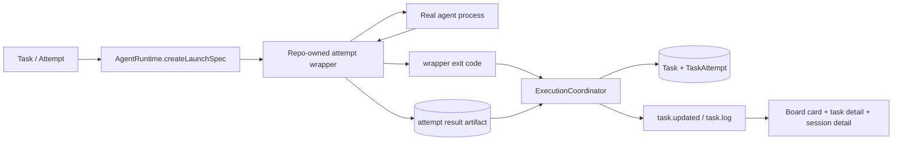

# fix: Implement Runtime Wrapper And Failure Visibility

## Overview

这份计划不是重复 003 的全量范围，而是把仓库里还没落地的部分单独提出来。

当前 six-column desktop、Add Task modal、task detail modal、session detail modal 已经是既有基线。真正还没完成的，是 runtime 的最终结果协议、`abort` 的强一致收口、`protocol_failure` 的持久化与 DTO 贯通，以及失败原因在 board 和 session 列表里的可见性。

## Problem Frame

从仓库现状看，系统仍然把“进程退出 + stdout marker”当作 attempt 最终真相。这样会继续留下三类问题：

- agent 实际退出后，task 和 current attempt 仍可能卡在 `executing / running / plan`
- `abort` 可能只是发出了 kill 请求，或只杀掉壳层进程，但状态已经先落成 `manually_aborted`
- `protocol_failure` 这类机器协议错误既没有正式进入 domain，也没有在 board summary 层稳定可见

所以这轮工作要收窄到一个明确目标：把最终状态裁决收口到 wrapper 协议与结果文件，同时把失败细分原因稳定透传到 desktop 现有壳层。

## Requirements Trace

| Area | Covered Requirements | Planning Consequence |
| --- | --- | --- |
| Wrapper result protocol | R1-R5g | 最终成功判定必须从 marker-centric 改成 wrapper-centric，且继续沿现有 runtime 主干接入 |
| Abort consistency | R5e-R5f | `abort` 只有在真实 agent 进程树停止后才能落成 `manually_aborted` |
| Failure visibility | R12, R15a, R17-R20a | 失败仍进 `Failed` 列，但 board 卡片、session 列表、session 详情必须能区分失败原因 |
| Existing shell invariants | R6-R11, R13-R16, R18-R21 | desktop-first 六列和 modal 叠加路径视为已完成基线，不在这份计划里重做 |

## Scope Boundaries

- 不重做 six-column board、Add Task modal、task detail modal、session detail modal 的基础信息架构
- 不引入第二套 executor；wrapper 必须沿现有 `AgentRuntime -> runner -> coordinator` 链接入
- 不新增独立的 `task_event` 类型来表达 `protocol_failure`；本轮继续映射到 `execution_failed`
- 不改任务状态机的业务定义，只扩展 attempt 终止原因与最终裁决逻辑
- 不把这轮扩大成“自定义步骤系统”或“步骤级结果协议”
- 不把 summary failure hint 设计成新的 board 列或新的 UI 状态机

## Context & Research

### Relevant Code and Patterns

- [AgentRuntime.ts](/D:/Code/Projects/tasks-dispatcher/packages/workspace-runtime/src/agents/AgentRuntime.ts) 当前 launch spec 只有 `command / args / stdinText`，是 wrapper 接入的自然边界。
- [CodexCliRuntime.ts](/D:/Code/Projects/tasks-dispatcher/packages/workspace-runtime/src/agents/CodexCliRuntime.ts) 和 [ClaudeCodeRuntime.ts](/D:/Code/Projects/tasks-dispatcher/packages/workspace-runtime/src/agents/ClaudeCodeRuntime.ts) 目前直接启动真实 agent，需要降级为“提供真实 target”。
- [NodeChildProcessRunner.ts](/D:/Code/Projects/tasks-dispatcher/packages/workspace-runtime/src/agents/NodeChildProcessRunner.ts) 应继续只负责执行 spec，不负责解释结果。
- [ExecutionCoordinator.ts](/D:/Code/Projects/tasks-dispatcher/packages/workspace-runtime/src/dispatching/ExecutionCoordinator.ts) 是当前唯一最终 settle 点，必须继续保持这个收口。
- [AgentProcessSupervisor.ts](/D:/Code/Projects/tasks-dispatcher/packages/workspace-runtime/src/dispatching/AgentProcessSupervisor.ts) 现在仍把 `code === 0` 视为 `completed`，并在 `abort()` 时只发 `SIGTERM`，这是当前错误语义的关键来源。
- [WorkspaceRuntimeService.ts](/D:/Code/Projects/tasks-dispatcher/packages/workspace-runtime/src/server/WorkspaceRuntimeService.ts) 的 `abortTask()` 目前会 broad catch 后回退到 domain-level abort，必须收紧。
- [TaskAttempt.ts](/D:/Code/Projects/tasks-dispatcher/packages/core/src/domain/TaskAttempt.ts) 还没有 `protocol_failure` termination reason。
- [TaskDtos.ts](/D:/Code/Projects/tasks-dispatcher/packages/core/src/contracts/TaskDtos.ts) 的 detail DTO 已能承载 attempt termination reason，但 summary DTO 还不够。
- [TaskCard.tsx](/D:/Code/Projects/tasks-dispatcher/apps/desktop/src/renderer/components/TaskCard.tsx) 和 [TaskSessionList.tsx](/D:/Code/Projects/tasks-dispatcher/apps/desktop/src/renderer/components/TaskSessionList.tsx) 还看不到失败细分原因。
- [TaskSessionDetailModal.tsx](/D:/Code/Projects/tasks-dispatcher/apps/desktop/src/renderer/components/TaskSessionDetailModal.tsx) 已经展示 `terminationReason`，应该作为完整上下文展示层保留。

### Institutional Learnings

- [single-workspace-runtime-owner-2026-03-29.md](/D:/Code/Projects/tasks-dispatcher/docs/solutions/best-practices/single-workspace-runtime-owner-2026-03-29.md)
  runtime 真相必须继续由共享 runtime owner 提供，desktop 不能为了解析最终结果去绕过 runtime 直读 SQLite。
- [task-vs-task-attempt-boundary-2026-03-29.md](/D:/Code/Projects/tasks-dispatcher/docs/solutions/best-practices/task-vs-task-attempt-boundary-2026-03-29.md)
  `protocol_failure` 和 `manually_aborted` 应继续留在 attempt 维度，不能提升成 task 级状态分叉。
- [windows-codex-process-launch-gotchas-2026-03-29.md](/D:/Code/Projects/tasks-dispatcher/docs/solutions/integration-issues/windows-codex-process-launch-gotchas-2026-03-29.md)
  Windows 上 `codex` 的包装链不是普通 Unix 子进程，wrapper 和 abort 路径必须保留平台分支意识。

### External References

- 不做额外外部研究。当前工作由本仓库的 runtime 结构、既有 plan 和 institutional learnings 决定，本地证据已经足够。

## Key Technical Decisions

- **最终成功判定改为 wrapper-owned result protocol**：成功必须同时满足“wrapper `exit code = 0`”和“当前 attempt 正式结果文件存在且可解析”。这保证未来 prompt 和步骤可变，但机器协议固定。
- **继续沿现有启动主干接入 wrapper**：wrapper 放在 `AgentRuntime.createLaunchSpec()` 产出的启动规格里，而不是另起平行 executor。
- **`ExecutionCoordinator` 继续做唯一最终裁决者**：supervisor 只做日志和阶段观测，result artifact 的解释必须继续收口在 coordinator。
- **`protocol_failure` 进入 attempt termination reason，而不是新增 task event type**：task 级别仍统一落为 `execution_failed`，细分失败原因保存在 attempt 和 DTO。
- **`abort` 以进程树停止事实为准**：只有 wrapper 确认真实 child process tree 已停止，attempt 才能被标记为 `manually_aborted`。
- **desktop 继续维持 `Failed` 单列**：失败细分通过 summary failure hint、session 摘要和 session detail 展示，不增加第七列。
- **旧测试中“complete marker 即成功”的语义必须被替换**：stage marker 可以继续留作阶段观测，但不能再承担最终成功裁决。

## Open Questions

### Resolved During Planning

- wrapper 应沿现有 `AgentRuntime -> NodeChildProcessRunner -> ExecutionCoordinator` 链接入，而不是另起执行架构
- `protocol_failure` 继续映射到 `execution_failed` event，而不是新增 event type
- SQLite schema 不需要为 `protocol_failure` 单独做 migration，`termination_reason` 已经是 `TEXT`
- failure visibility 的最小落点是 summary failure hint + session list 摘要 + session detail 完整展示
- 003 计划里的 desktop shell baseline 视为已完成，这份新计划只保留仍未落地的工作

### Deferred to Implementation

- wrapper 正式结果文件的 envelope 字段和校验细节
- Windows 下 codex/claude 进程树终止的最终实现方式
- summary failure hint 的字段命名与序列化形状

## High-Level Technical Design

> This illustrates the intended approach and is directional guidance for review, not implementation specification. The implementing agent should treat it as context, not code to reproduce.

### Settle Matrix

| Wrapper exit | Result artifact | Runtime outcome |
| --- | --- | --- |
| `0` | valid | success -> `pending_validation` |
| `0` | missing / invalid | `protocol_failure` -> `execution_failed` |
| non-zero | any | process failure -> `execution_failed` |
| runtime-initiated abort | wrapper confirms tree stopped | `manually_aborted` -> `execution_failed` |

## Implementation Units

- [x] **Unit 1: Introduce wrapper launch specs and result artifact paths**

**Goal:** 把真实 agent 启动边界下沉到 repo-owned wrapper，并为每个 attempt 引入统一的结果文件路径。

**Requirements:** R1-R5f

**Dependencies:** None

**Files:**
- Create: `packages/workspace-runtime/src/agents/wrapper/AgentAttemptWrapper.ts`
- Create: `packages/workspace-runtime/src/persistence/AttemptResultFileStore.ts`
- Modify: `packages/workspace-runtime/src/agents/AgentRuntime.ts`
- Modify: `packages/workspace-runtime/src/agents/CodexCliRuntime.ts`
- Modify: `packages/workspace-runtime/src/agents/ClaudeCodeRuntime.ts`
- Modify: `packages/workspace-runtime/src/bootstrap/WorkspacePaths.ts`
- Modify: `packages/workspace-runtime/src/persistence/WorkspaceStorage.ts`
- Test: `packages/workspace-runtime/tests/agents/AgentAttemptWrapper.test.ts`
- Test: `packages/workspace-runtime/tests/bootstrap/WorkspacePaths.test.ts`

**Approach:**
- 扩展 launch spec，使 runtime 在创建 launch spec 时就绑定 `taskId`、`attemptId`、结果文件路径以及真实 agent target。
- 让具体 runtime 返回 wrapper 启动规格，而不是直接把 codex/claude 暴露给 runner。
- 为 `.tasks-dispatcher` 状态目录新增结果文件路径管理，并与现有 logs/runtime 路径并存。
- wrapper 负责启动真实 agent、透传 stdout/stderr、写入临时结果并原子晋升为正式结果文件。

**Execution note:** Add characterization coverage before replacing the direct-launch path.

**Patterns to follow:**
- 复用 [WorkspacePaths.ts](/D:/Code/Projects/tasks-dispatcher/packages/workspace-runtime/src/bootstrap/WorkspacePaths.ts) 的集中式路径管理
- 保持 [NodeChildProcessRunner.ts](/D:/Code/Projects/tasks-dispatcher/packages/workspace-runtime/src/agents/NodeChildProcessRunner.ts) 的“执行 spec”职责边界
- 保留 [windows-codex-process-launch-gotchas-2026-03-29.md](/D:/Code/Projects/tasks-dispatcher/docs/solutions/integration-issues/windows-codex-process-launch-gotchas-2026-03-29.md) 里已经验证过的 Windows launch 分支

**Test scenarios:**
- Happy path: wrapper 启动真实 codex/claude target 并把 stdout/stderr 继续透传到现有日志链路
- Happy path: wrapper 在 child 正常完成时写出正式结果文件，路径与当前 task/attempt 一一对应
- Edge case: wrapper 先写临时文件再原子提交，最终路径不会留下半写入内容
- Error path: wrapper 自身异常退出时不会伪造成功结果文件
- Integration: Windows 下 codex launch 仍保留 `cmd.exe /d /s /c codex.cmd` 路径，不重新引入 prompt split 或 `spawn EINVAL`

**Verification:**
- launch spec、workspace result paths 和 wrapper artifact 生成都被独立测试锁住
- 直接启动真实 agent 的旧路径不再是默认执行边界

- [x] **Unit 2: Refactor execution settle around wrapper results**

**Goal:** 把 attempt 最终成功/失败判定从“进程关闭 + marker”改成“wrapper exit + result artifact”，并正式引入 `protocol_failure`。

**Requirements:** R1-R5d, R5g

**Dependencies:** Unit 1

**Files:**
- Modify: `packages/core/src/domain/TaskAttempt.ts`
- Modify: `packages/workspace-runtime/src/dispatching/ExecutionCoordinator.ts`
- Modify: `packages/workspace-runtime/src/dispatching/AgentProcessSupervisor.ts`
- Test: `packages/core/tests/domain/TaskAttempt.test.ts`
- Test: `packages/core/tests/application/TaskLifecycleServices.test.ts`
- Test: `packages/workspace-runtime/tests/dispatching/ExecutionCoordinator.test.ts`
- Test: `packages/workspace-runtime/tests/persistence/SqliteTaskRepository.test.ts`

**Approach:**
- 在 attempt termination reasons 中新增 `protocol_failure`，并让 DTO / repository round-trip 保持该值不丢失。
- 保留 stage marker 作为 `plan / develop / self_check` 的观测信号，但不再把 `complete` marker 视为最终成功条件。
- `ExecutionCoordinator` 在 wrapper 退出后读取当前 attempt 的正式结果文件，再结合退出码决定 `pending_validation`、`execution_failed/protocol_failure` 或既有进程失败原因。
- `AgentProcessSupervisor` 的退出语义要收窄为“报告退出事实与观测信号”，不再单独拥有“成功”判定权。

**Execution note:** Replace the old completion-marker assertions before wiring the new settle matrix.

**Patterns to follow:**
- 维持 [Task.ts](/D:/Code/Projects/tasks-dispatcher/packages/core/src/domain/Task.ts) 中 task state 与 attempt lifecycle 分层
- 继续让 [ExecutionCoordinator.ts](/D:/Code/Projects/tasks-dispatcher/packages/workspace-runtime/src/dispatching/ExecutionCoordinator.ts) 成为唯一最终 settle 点
- 遵循 [task-vs-task-attempt-boundary-2026-03-29.md](/D:/Code/Projects/tasks-dispatcher/docs/solutions/best-practices/task-vs-task-attempt-boundary-2026-03-29.md) 的 attempt 级失败边界

**Test scenarios:**
- Happy path: wrapper exit `0` 且结果文件有效时，task 收敛到 `pending_validation`，attempt 为 `completed`
- Error path: wrapper exit `0` 但结果文件缺失时，task 收敛到 `execution_failed`，attempt 为 `failed/protocol_failure`
- Error path: wrapper exit `0` 但结果文件损坏或不可解析时，task 收敛到 `execution_failed`，attempt 为 `failed/protocol_failure`
- Error path: wrapper non-zero exit 时，task 继续保留既有进程级失败原因，而不是被覆盖成 `protocol_failure`
- Integration: `protocol_failure` 在 domain -> DTO -> SQLite -> reload 全链路 round-trip 后保持不变

**Verification:**
- `ExecutionCoordinator` 不再因为 `TASKS_DISPATCHER_STAGE:complete` 自动判成功
- `AgentProcessSupervisor` 不再仅凭 `exit code === 0` 发出最终成功结论
- runtime 测试能稳定区分 success、process failure、protocol failure 三种终态

- [x] **Unit 3: Make abort strongly consistent with process-tree stop**

**Goal:** 让 `abort` 只在真实 agent 进程树确认停止后落成 `manually_aborted`，不再出现“状态先中止、进程后清理”的假象。

**Requirements:** R5e-R5f

**Dependencies:** Unit 1, Unit 2

**Files:**
- Modify: `packages/workspace-runtime/src/dispatching/AgentProcessSupervisor.ts`
- Modify: `packages/workspace-runtime/src/dispatching/ExecutionCoordinator.ts`
- Modify: `packages/workspace-runtime/src/server/WorkspaceRuntimeService.ts`
- Modify: `packages/workspace-runtime/src/agents/wrapper/AgentAttemptWrapper.ts`
- Test: `packages/workspace-runtime/tests/agents/AgentAttemptWrapper.test.ts`
- Test: `packages/workspace-runtime/tests/dispatching/ExecutionCoordinator.test.ts`
- Test: `packages/workspace-runtime/tests/server/WorkspaceRuntimeService.test.ts`

**Approach:**
- 把真实 child process tree 的终止逻辑集中在 wrapper，而不是让 supervisor 直接假设 `SIGTERM` 成功。
- `ExecutionCoordinator.abortTask()` 应等待 wrapper 返回“已停止”事实，再进行最终 settle。
- 收紧 `WorkspaceRuntimeService.abortTask()`，移除 broad catch 回退到 domain-level abort 的路径，避免吞掉真实中止失败。
- 保持 runtime 作为唯一中止入口，desktop 和 IPC 仍只请求 runtime abort，不直接碰本地进程。

**Patterns to follow:**
- 延续 [single-workspace-runtime-owner-2026-03-29.md](/D:/Code/Projects/tasks-dispatcher/docs/solutions/best-practices/single-workspace-runtime-owner-2026-03-29.md) 的 runtime owner 原则
- 参考 [windows-codex-process-launch-gotchas-2026-03-29.md](/D:/Code/Projects/tasks-dispatcher/docs/solutions/integration-issues/windows-codex-process-launch-gotchas-2026-03-29.md) 的 Windows launch/kill 保守策略

**Test scenarios:**
- Happy path: 运行中的 attempt 点击 abort 后，只有在 wrapper 确认 child process tree 已退出时才返回 `manually_aborted`
- Error path: abort 失败或 wrapper 无法确认停止时，不会把 task 错标为 `manually_aborted`
- Edge case: Windows 包装链下 abort 不会只杀 `cmd.exe` 而遗留真实 agent
- Integration: abort 结果通过 runtime service 返回到 task detail / board 更新链路时，最终 state 与 attempt reason 一致

**Verification:**
- active execution 的 abort 结果与真实进程停止事实一致
- runtime service 不再在 coordinator abort 失败时直接回退到 domain abort

- [x] **Unit 4: Surface failure reasons through summary DTOs and desktop UI**

**Goal:** 在不改变六列看板结构的前提下，让 `protocol_failure` 和 `manually_aborted` 在 board、session 列表和 session 详情里稳定可见。

**Requirements:** R12, R15a, R17-R20a

**Dependencies:** Unit 2

**Files:**
- Modify: `packages/core/src/contracts/TaskDtos.ts`
- Modify: `apps/desktop/src/renderer/pages/TaskBoardPage.tsx`
- Modify: `apps/desktop/src/renderer/components/TaskCard.tsx`
- Modify: `apps/desktop/src/renderer/components/TaskDetailModal.tsx`
- Modify: `apps/desktop/src/renderer/components/TaskSessionList.tsx`
- Modify: `apps/desktop/src/renderer/components/TaskSessionDetailModal.tsx`
- Test: `apps/desktop/src/renderer/__tests__/TaskCard.test.tsx`
- Test: `apps/desktop/src/renderer/__tests__/TaskDetailModal.test.tsx`
- Test: `apps/desktop/src/renderer/__tests__/TaskSessionList.test.tsx`
- Test: `apps/desktop/src/renderer/__tests__/TaskSessionDetailModal.test.tsx`
- Test: `apps/desktop/src/renderer/__tests__/TaskBoardPage.test.tsx`

**Approach:**
- 给 board summary 层补一个最小 failure hint，避免卡片为了显示失败原因必须额外拉 detail 或重建新的状态机。
- `TaskBoardPage` 在 detail -> summary 的压缩映射里保留 failure hint，避免 runtime event 更新时再次丢失。
- `TaskCard` 只展示轻量原因标签，完整上下文仍留在 task detail / session detail。
- `TaskSessionList` 至少展示 session 的 termination summary；`TaskSessionDetailModal` 继续作为完整原因展示层。

**Patterns to follow:**
- 保持 [boardModel.ts](/D:/Code/Projects/tasks-dispatcher/apps/desktop/src/renderer/board/boardModel.ts) 的固定六列映射，不把 failure reason 升格为新列
- 复用 [TaskSessionDetailModal.tsx](/D:/Code/Projects/tasks-dispatcher/apps/desktop/src/renderer/components/TaskSessionDetailModal.tsx) 的现有 modal 叠加路径

**Test scenarios:**
- Happy path: `execution_failed/protocol_failure` 任务仍进入 `Failed` 列，并显示明确原因标签
- Happy path: `execution_failed/manually_aborted` 任务仍进入 `Failed` 列，并与普通失败可区分
- Edge case: task detail 打开某个失败 session 后，session detail 关闭仍返回原 task detail 上下文
- Integration: runtime `task.updated` 事件把 detail 压回 summary 时不会丢失 failure hint

**Verification:**
- board 卡片、session 列表、session detail 三层都能看到一致的失败原因信息
- 六列看板结构和 modal 返回路径保持不变

- [x] **Unit 5: Rebuild regression coverage around the new protocol**

**Goal:** 用 characterization-first 的测试覆盖锁住 success、protocol failure、abort 和 desktop failure visibility 的新语义。

**Requirements:** R1-R5g, R15a

**Dependencies:** Unit 1, Unit 2, Unit 3, Unit 4

**Files:**
- Modify: `packages/workspace-runtime/tests/dispatching/ExecutionCoordinator.test.ts`
- Modify: `packages/workspace-runtime/tests/agents/AgentProcessSupervisor.test.ts`
- Modify: `packages/workspace-runtime/tests/persistence/SqliteTaskRepository.test.ts`
- Modify: `packages/core/tests/domain/TaskAttempt.test.ts`
- Modify: `packages/core/tests/application/TaskLifecycleServices.test.ts`
- Create: `packages/workspace-runtime/tests/server/WorkspaceRuntimeService.test.ts`
- Create: `apps/desktop/src/renderer/__tests__/TaskSessionList.test.tsx`
- Modify: `apps/desktop/src/main/__tests__/desktopStartupSmoke.test.ts`
- Modify: `apps/desktop/src/renderer/__tests__/TaskCard.test.tsx`
- Modify: `apps/desktop/src/renderer/__tests__/TaskBoardPage.test.tsx`

**Approach:**
- 先替换掉旧的“complete marker 即成功”测试假设，再引入 wrapper/result-file 的新断言。
- 对 runtime 保持 characterization-style 覆盖，重点锁住 success、protocol_failure、manually_aborted 三条闭环。
- 对 desktop 继续采用组件测试为主、smoke 为辅，不把这轮 failure visibility 扩大成重型 E2E 套件。

**Execution note:** Characterization-first. Replace tests that currently bless the old marker-centric behavior before relying on them for refactors.

**Patterns to follow:**
- 延续现有 vitest 组件测试和 runtime integration-style 测试结构
- 保持 desktop smoke 的“真实 workspace + runtime bridge”方向，不退回纯 mock-only 验证

**Test scenarios:**
- Happy path: queue 后 valid result 收敛到 `pending_validation`
- Error path: queue 后 missing/corrupt result 收敛到 `execution_failed/protocol_failure`
- Error path: queue 后 abort 只在真实进程树停止后收敛到 `execution_failed/manually_aborted`
- Integration: `protocol_failure` 和 `manually_aborted` 在 repository round-trip 与 desktop render 层都保持一致
- Integration: desktop smoke 覆盖 failure reason 从 runtime 到 renderer 的最终可见链路

**Verification:**
- 旧的 marker-centric 成功语义不再被测试正式背书
- 新协议、abort 和 failure visibility 都有稳定回归保护

## System-Wide Impact

- **Interaction graph:** `AgentRuntime`、wrapper、`ExecutionCoordinator`、repository、DTO、desktop board 与 session modal 都会被同一条结果协议串联起来。
- **Error propagation:** wrapper 结果异常要统一沿 `ExecutionCoordinator -> TaskAttempt terminationReason -> task.updated DTO -> renderer` 传播，而不是停留在日志层。
- **State lifecycle risks:** 结果文件必须有 temp -> validate -> atomic promote 语义，避免 `exit 0` 后读取到半写入内容。
- **API surface parity:** IPC 与 runtime client 层主要通过 DTO 自然吃到新字段，不应另起旁路读取数据库。
- **Integration coverage:** 仅靠单元测试无法证明 wrapper、settle、abort、desktop render 这一整条链路，需要保留 runtime/desktop 级闭环验证。
- **Unchanged invariants:** 六列看板映射、task-level state machine、existing runtime owner 模式、task detail -> session detail 的 modal 叠加路径都保持不变。

## Risks & Dependencies

| Risk | Mitigation |
|------|------------|
| wrapper 被做成第二套执行系统，导致启动链分裂 | 把 wrapper 接入点钉死在 `AgentRuntime.createLaunchSpec()`，runner 继续只执行 spec |
| 结果文件没有原子提交，`exit 0` 时读到半成品 | 使用 temp -> validate -> atomic promote，runtime 只读 final path |
| abort 继续只杀壳层，留下真实 agent | 把进程树终止逻辑集中在 wrapper，并补 Windows 包装链测试 |
| failure reason 为了显示而破坏 board 信息密度 | card 只展示最小 failure hint，完整上下文留给 detail/session 层 |
| 旧测试继续背书 marker-centric 成功语义 | 在重构前先替换相关测试断言，再接入新协议 |

## Documentation / Operational Notes

- 这份计划可以作为 003 的执行收敛版；如果后续继续推进 `ce:work`，应优先以这份计划为准，而不是再把已完成 baseline 单元纳入实现范围。
- 若 wrapper 结果文件最终落在 `.tasks-dispatcher/runtime/results/`，需要与现有 logs/runtime 目录一起纳入清理与 workspace 生命周期考虑。

## Sources & References

- **Origin document:** [2026-03-29-runtime-state-sync-and-kanban-desktop-requirements.md](/D:/Code/Projects/tasks-dispatcher/docs/brainstorms/2026-03-29-runtime-state-sync-and-kanban-desktop-requirements.md)
- **Extracted from:** [2026-03-29-003-fix-runtime-state-sync-and-kanban-desktop-plan.md](/D:/Code/Projects/tasks-dispatcher/docs/plans/2026-03-29-003-fix-runtime-state-sync-and-kanban-desktop-plan.md)
- Related code: [AgentRuntime.ts](/D:/Code/Projects/tasks-dispatcher/packages/workspace-runtime/src/agents/AgentRuntime.ts)
- Related code: [ExecutionCoordinator.ts](/D:/Code/Projects/tasks-dispatcher/packages/workspace-runtime/src/dispatching/ExecutionCoordinator.ts)
- Related code: [TaskAttempt.ts](/D:/Code/Projects/tasks-dispatcher/packages/core/src/domain/TaskAttempt.ts)
- Related code: [TaskDtos.ts](/D:/Code/Projects/tasks-dispatcher/packages/core/src/contracts/TaskDtos.ts)
- Related code: [TaskCard.tsx](/D:/Code/Projects/tasks-dispatcher/apps/desktop/src/renderer/components/TaskCard.tsx)
- Related code: [TaskSessionList.tsx](/D:/Code/Projects/tasks-dispatcher/apps/desktop/src/renderer/components/TaskSessionList.tsx)
- Institutional learning: [single-workspace-runtime-owner-2026-03-29.md](/D:/Code/Projects/tasks-dispatcher/docs/solutions/best-practices/single-workspace-runtime-owner-2026-03-29.md)
- Institutional learning: [task-vs-task-attempt-boundary-2026-03-29.md](/D:/Code/Projects/tasks-dispatcher/docs/solutions/best-practices/task-vs-task-attempt-boundary-2026-03-29.md)
- Institutional learning: [windows-codex-process-launch-gotchas-2026-03-29.md](/D:/Code/Projects/tasks-dispatcher/docs/solutions/integration-issues/windows-codex-process-launch-gotchas-2026-03-29.md)
