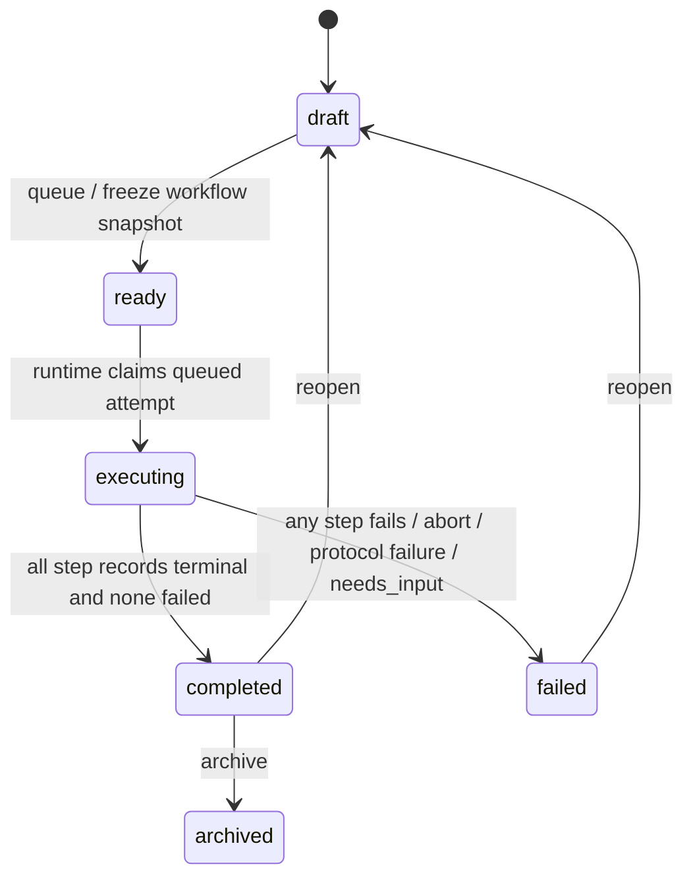
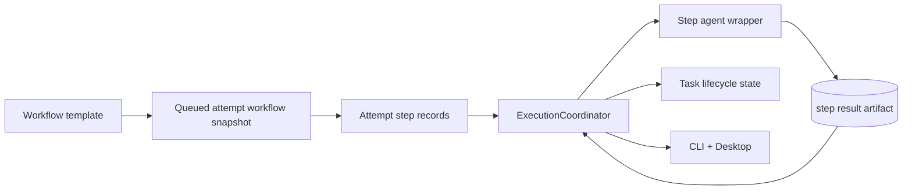

# refactor: Adopt Task Lifecycle And Workflow Step State Model

## Overview

这次不是再补一个 runtime bug，而是把当前已经跑通的本地任务系统，重新立在一套更稳定的状态模型上。目标是把任务生命周期、流程模板、attempt 历史和步骤执行状态彻底分层，为后续自定义流程、每步不同 agent、串行步骤编排打基础，同时避免当前旧命名继续污染后续设计。

## Problem Frame

当前仓库里仍然保留着旧状态和旧边界：

- 任务生命周期仍是 `initializing / pending_execution / pending_validation / execution_failed / reopened`
- attempt 仍用单个 `stage` 字段表达执行阶段，且命名还是 `plan / develop / self_check`
- workflow 只是一个 `workflowId / workflowLabel` 占位，没有冻结快照和步骤定义边界
- desktop board 和 CLI 都直接消费这些旧状态字符串

如果继续在这个模型上叠功能，后面一旦加入“ready 时冻结流程”“多个步骤串行执行”“每步不同 agent”“步骤级失败可见性”，会同时遇到命名漂移、历史污染和控制流歧义。

## Requirements Trace

| Area | Covered Requirements | Planning Consequence |
| --- | --- | --- |
| Task lifecycle refactor | R1-R7 | 需要移除 `reopened` 作为状态，统一收敛为 `draft / ready / executing / completed / failed / archived` |
| Workflow snapshot semantics | R8-R11 | 流程快照必须在 `ready` 冻结；实现上不能等到 `executing` 才决定这一版任务到底跑什么 |
| Attempt and step model | R12-R23 | `TaskAttempt` 需要从“单 stage”升级为“流程快照 + 步骤记录 + 步骤状态”，同时保留 attempt 历史边界 |
| Runtime step orchestration | R24-R34 | `ExecutionCoordinator` 需要从“一次 attempt 一个 agent”升级为“一个 attempt 内顺序执行多个步骤 agent” |
| No interactive execution | R30a-R30c | 本轮不得引入执行中对话框；需要把交互需求收口成明确失败语义 |

## Scope Boundaries

- 不交付自定义流程编辑器；本轮只把默认流程落成稳定模型
- 不引入步骤级重试、并行步骤、条件分支执行或多 active attempts
- 不实现 human-in-the-loop 执行对话框、暂停恢复会话或执行中用户回复
- 不把步骤成功条件开放成用户可编辑的机器规则
- 不扩大成多 workspace、多人协作或远端 orchestration 设计

## Context & Research

### Relevant Code and Patterns

- [TaskState.ts](/D:/Code/Projects/tasks-dispatcher/packages/core/src/domain/TaskState.ts) 仍定义旧任务状态，是生命周期重构的主落点。
- [TaskStateMachine.ts](/D:/Code/Projects/tasks-dispatcher/packages/core/src/domain/TaskStateMachine.ts) 现在把 `reopened` 视为可编辑状态、把 `pending_validation` 视为可归档状态，必须整体改写。
- [Task.ts](/D:/Code/Projects/tasks-dispatcher/packages/core/src/domain/Task.ts) 当前在 `queueForExecution()` 创建 attempt，并把 `reopen()` 落成 `reopened` 状态；这正好是把 ready 冻结快照落到 attempt 上的自然边界。
- [TaskAttempt.ts](/D:/Code/Projects/tasks-dispatcher/packages/core/src/domain/TaskAttempt.ts) 现在只有单个 `stage` 字段，是步骤记录建模的最直接迁移点。
- [TaskWorkflow.ts](/D:/Code/Projects/tasks-dispatcher/packages/core/src/domain/TaskWorkflow.ts) 当前只是默认 workflow id/label 常量，需要升级为默认流程模板和流程快照来源。
- [ExecutionCoordinator.ts](/D:/Code/Projects/tasks-dispatcher/packages/workspace-runtime/src/dispatching/ExecutionCoordinator.ts) 当前只编排一个 attempt 对应一个 agent 进程；未来默认流程步骤需要在这里顺序推进。
- [AgentPromptFactory.ts](/D:/Code/Projects/tasks-dispatcher/packages/workspace-runtime/src/agents/AgentPromptFactory.ts) 仍按 `plan / develop / self_check` 生成 prompt，且还默认允许“最小假设继续”但没有把 `needs_input` 失配路径显式收口。
- [SqliteTaskRepository.ts](/D:/Code/Projects/tasks-dispatcher/packages/workspace-runtime/src/persistence/SqliteTaskRepository.ts) 和 [001_initial_schema.sql](/D:/Code/Projects/tasks-dispatcher/packages/workspace-runtime/src/persistence/migrations/001_initial_schema.sql) 目前只能持久化 task 和 attempt 的扁平字段，不足以承载流程快照与步骤记录。
- [TaskDtos.ts](/D:/Code/Projects/tasks-dispatcher/packages/core/src/contracts/TaskDtos.ts)、[TaskStatusActions.tsx](/D:/Code/Projects/tasks-dispatcher/apps/desktop/src/renderer/components/TaskStatusActions.tsx)、[boardModel.ts](/D:/Code/Projects/tasks-dispatcher/apps/desktop/src/renderer/board/boardModel.ts) 与 CLI state commands 都直接依赖旧状态命名。

### Institutional Learnings

- [task-vs-task-attempt-boundary-2026-03-29.md](/D:/Code/Projects/tasks-dispatcher/docs/solutions/best-practices/task-vs-task-attempt-boundary-2026-03-29.md)
  Task 和 TaskAttempt 的分层必须继续保留；新的步骤记录只能长在 attempt 下面，不能回流到 task 上。
- [single-workspace-runtime-owner-2026-03-29.md](/D:/Code/Projects/tasks-dispatcher/docs/solutions/best-practices/single-workspace-runtime-owner-2026-03-29.md)
  所有状态推进仍应通过共享 runtime owner 完成，不能让 CLI 或 desktop 各自发明编排逻辑。
- [windows-codex-process-launch-gotchas-2026-03-29.md](/D:/Code/Projects/tasks-dispatcher/docs/solutions/integration-issues/windows-codex-process-launch-gotchas-2026-03-29.md)
  任何把“上一步退出 -> 下一步启动”落到子进程编排里的设计，都必须继续尊重 Windows 包装链。

### External References

- 不做额外外部研究。当前问题由本仓库现有 domain 模型、runtime 编排和 UI 映射直接决定，本地证据足够。

## Key Technical Decisions

- **`ready` 时冻结流程快照，并把它附着在新建的 queued attempt 上**：不单独再做“任务级当前流程快照”副本。这样最小改动就能满足“ready 冻结”和“attempt 历史独立”。
- **移除 `reopened` 生命周期状态，只保留 `reopen` 操作**：任务被 reopen 后直接回 `draft`，这样生命周期枚举更干净，也符合“只有 draft 可编辑”。
- **旧 `pending_validation` 状态统一改名为 `completed`**：`completed` 是稳定等待态，不再隐含人工 review 流程。
- **步骤定义和步骤运行记录彻底分开**：流程模板只保存 `name / agent / prompt`；attempt 记录保存某次执行时的步骤状态、时间和失败原因。
- **内部两层、外部一层**：内部模型要同时有“当前步骤 key”和“步骤运行状态”；对外 UI 可以继续先展示步骤名。
- **默认流程先作为固定模板落地**：第一版直接把 `plan -> work -> review` 做成默认 workflow，不把规划时间花在可视化流程编辑器上。
- **默认步骤串行，一步一个 agent，自然退出后再推进下一步**：正常路径不靠 runtime 强杀上一步 agent。
- **执行中问答一律不进入交互模式**：需要用户输入时，步骤和 attempt 直接收口成明确失败原因，任务进入 `failed`。
- **保留 `currentAttemptId` 作为最新 attempt 指针**：active attempt 的唯一性由任务状态和 attempt status 保证，不在这轮额外拆出 `latestAttemptId` / `activeAttemptId` 两套字段。

## Open Questions

### Resolved During Planning

- 流程快照在 `ready` 冻结，而不是在 `executing` 才冻结
- `reopen` 是操作，不是新状态
- 默认流程先固定为 `plan -> work -> review`
- 执行中问答在当前版本一律禁止，不新增 UI 对话框
- 一个任务同一时刻最多只允许一个 active attempt

### Deferred to Implementation

- 步骤记录最终用单独表、嵌套 JSON，还是两者混合持久化更合适
- 步骤级结果协议的 envelope 和失败原因分类粒度
- `needs_input` / `interaction_required` 作为 attempt termination reason、step failure reason，还是两层都保留
- 是否需要对已有本地 SQLite 数据做显式 backfill，还是允许通过版本迁移 + 惰性兼容完成收敛

## High-Level Technical Design

> This illustrates the intended approach and is directional guidance for review, not implementation specification. The implementing agent should treat it as context, not code to reproduce.

## Implementation Units

- [ ] **Unit 1: Refactor core lifecycle states and remove `reopened`**

**Goal:** 把任务生命周期从旧状态集迁移到 `draft / ready / executing / completed / failed / archived`，同时移除 `reopened` 状态语义。

**Requirements:** R1-R7, R14-R15

**Dependencies:** None

**Files:**
- Modify: `packages/core/src/domain/TaskState.ts`
- Modify: `packages/core/src/domain/ExecutionStage.ts`
- Modify: `packages/core/src/domain/TaskStateMachine.ts`
- Modify: `packages/core/src/domain/Task.ts`
- Modify: `packages/core/src/domain/TaskEvent.ts`
- Modify: `packages/core/src/domain/index.ts`
- Modify: `packages/core/src/application/services/ReopenTaskService.ts`
- Modify: `packages/core/src/application/services/QueueTaskService.ts`
- Modify: `packages/core/src/application/services/GetTaskBoardService.ts`
- Test: `packages/core/tests/domain/TaskStateMachine.test.ts`
- Test: `packages/core/tests/application/TaskLifecycleServices.test.ts`

**Approach:**
- 把旧状态字符串统一迁移到新生命周期定义。
- `reopen()` 应回到 `draft`，并继续通过显式 event 表达动作，而不是保留 `reopened` 状态。
- 将 `pending_validation` 对应的生命周期语义更名为 `completed`，并同步归档/重开规则。
- 保持一个任务同时最多一个 active attempt 的约束不变。

**Execution note:** Characterization-first. Replace old state-name assertions before relying on them for refactors.

**Patterns to follow:**
- 继续沿 [Task.ts](/D:/Code/Projects/tasks-dispatcher/packages/core/src/domain/Task.ts) 和 [TaskStateMachine.ts](/D:/Code/Projects/tasks-dispatcher/packages/core/src/domain/TaskStateMachine.ts) 的聚合式状态推进模式
- 保持 [task-vs-task-attempt-boundary-2026-03-29.md](/D:/Code/Projects/tasks-dispatcher/docs/solutions/best-practices/task-vs-task-attempt-boundary-2026-03-29.md) 的 task/attempt 边界

**Test scenarios:**
- Happy path: `draft -> ready -> executing -> completed -> archived` 的主生命周期保持合法
- Happy path: `completed -> reopen -> draft` 后重新允许编辑
- Happy path: `failed -> reopen -> draft` 后重新允许编辑
- Error path: 非 `draft` 状态不能编辑；非 `completed` 状态不能归档
- Integration: `reopen` 不再留下 `reopened` 状态，但历史 attempts 继续保留

**Verification:**
- core domain 不再暴露 `reopened`、`pending_execution`、`pending_validation`、`execution_failed` 这些旧生命周期名
- lifecycle services 和状态机测试都以新状态语义通过

- [ ] **Unit 2: Freeze workflow snapshots on queued attempts and persist step records**

**Goal:** 把默认 workflow 从占位 id/label 升级为可冻结的流程快照，并为 attempt 引入步骤记录持久化模型。

**Requirements:** R8-R13, R16-R23

**Dependencies:** Unit 1

**Files:**
- Modify: `packages/core/src/domain/TaskWorkflow.ts`
- Modify: `packages/core/src/domain/TaskAttempt.ts`
- Modify: `packages/core/src/domain/Task.ts`
- Modify: `packages/core/src/domain/index.ts`
- Modify: `packages/core/src/contracts/TaskDtos.ts`
- Modify: `packages/core/src/contracts/index.ts`
- Modify: `packages/core/src/index.ts`
- Create: `packages/core/src/domain/TaskAttemptStep.ts`
- Create: `packages/core/src/domain/WorkflowStepStatus.ts`
- Modify: `packages/workspace-runtime/src/persistence/SqliteTaskRepository.ts`
- Modify: `packages/workspace-runtime/src/persistence/WorkspaceStorage.ts`
- Create: `packages/workspace-runtime/src/persistence/migrations/002_task_workflow_snapshots_and_steps.sql`
- Test: `packages/core/tests/domain/TaskAttempt.test.ts`
- Test: `packages/workspace-runtime/tests/persistence/SqliteTaskRepository.test.ts`
- Test: `packages/workspace-runtime/tests/persistence/WorkspaceStorage.test.ts`

**Approach:**
- 把默认流程定义为固定模板：`plan -> work -> review`，每步只带 `name / agent / prompt`。
- `draft -> ready` 时创建 queued attempt，并把当时选中的 workflow 冻结成 snapshot 绑定到该 attempt。
- 为 attempt 引入 step records，记录步骤 key、步骤状态、时间和失败原因。
- 扩展持久化层支持 workflow snapshot 与 step records；同时为现有本地数据提供状态值和阶段名迁移入口。

**Execution note:** Execution target: external-delegate

**Patterns to follow:**
- 复用 [SqliteTaskRepository.ts](/D:/Code/Projects/tasks-dispatcher/packages/workspace-runtime/src/persistence/SqliteTaskRepository.ts) 的 task/attempt round-trip 模式
- 保持 [TaskWorkflow.ts](/D:/Code/Projects/tasks-dispatcher/packages/core/src/domain/TaskWorkflow.ts) 作为默认 workflow 来源，不另起并行模板注册系统

**Test scenarios:**
- Happy path: `draft -> ready` 时，新 queued attempt 挂上 frozen workflow snapshot
- Happy path: 已存在历史 attempt 的任务 reopen 后再次进入 `ready`，新 queued attempt 绑定新 snapshot，旧 attempt snapshot 不变
- Edge case: 已有旧库状态值和旧阶段名的数据在迁移后仍能被正确 rehydrate
- Error path: workflow snapshot 或 step records 缺失时，repository 不会静默构造半残对象
- Integration: repository round-trip 后，attempt snapshot 和 step records 顺序、状态、失败原因都不丢失

**Verification:**
- queued attempt 已经成为 `ready` 冻结合同的唯一承载体
- persistence 层能稳定持久化和读取 workflow snapshots + step records

- [ ] **Unit 3: Replace attempt-stage execution with step-based orchestration**

**Goal:** 把 runtime 从“一次 attempt 一个 agent + 单个 stage”改成“一个 attempt 内串行执行多个步骤 agent”。

**Requirements:** R24-R34

**Dependencies:** Unit 1, Unit 2

**Files:**
- Modify: `packages/workspace-runtime/src/dispatching/ExecutionCoordinator.ts`
- Modify: `packages/workspace-runtime/src/dispatching/AgentProcessSupervisor.ts`
- Modify: `packages/workspace-runtime/src/agents/AgentPromptFactory.ts`
- Modify: `packages/workspace-runtime/src/agents/AgentRuntime.ts`
- Modify: `packages/workspace-runtime/src/agents/CodexCliRuntime.ts`
- Modify: `packages/workspace-runtime/src/agents/ClaudeCodeRuntime.ts`
- Modify: `packages/workspace-runtime/src/agents/wrapper/AgentAttemptWrapper.ts`
- Modify: `packages/workspace-runtime/src/agents/wrapper/AgentAttemptWrapperProtocol.ts`
- Modify: `packages/workspace-runtime/src/persistence/AttemptResultFileStore.ts`
- Modify: `packages/workspace-runtime/src/persistence/AttemptAbortSignalStore.ts`
- Modify: `packages/workspace-runtime/src/server/WorkspaceRuntimeService.ts`
- Test: `packages/workspace-runtime/tests/dispatching/ExecutionCoordinator.test.ts`
- Test: `packages/workspace-runtime/tests/agents/AgentAttemptWrapper.test.ts`
- Test: `packages/workspace-runtime/tests/agents/AgentProcessSupervisor.test.ts`

**Approach:**
- `ExecutionCoordinator` 应从 queued attempt snapshot 中找到当前待执行步骤，启动该步骤对应的 agent。
- 当前步骤成功后，先验证机器结果，再把该步骤标记为 `completed` 并推进下一步骤；只有所有步骤终态且无失败时，attempt 才成功。
- 步骤 prompt 必须明确禁止提问；如果 agent 仍无法继续，runtime 应将其收口为 `needs_input` / `interaction_required` 类失败。
- 保持正常成功路径下 agent 自然退出，只有 abort/timeout/协议异常时才强制终止。
- 现有 wrapper/result protocol 应升级为步骤级结果判定，而不是继续只在 attempt 末端一次性判定。

**Execution note:** Characterization-first; Execution target: external-delegate

**Patterns to follow:**
- 保留 [ExecutionCoordinator.ts](/D:/Code/Projects/tasks-dispatcher/packages/workspace-runtime/src/dispatching/ExecutionCoordinator.ts) 作为 runtime 唯一收口者
- 保持 [single-workspace-runtime-owner-2026-03-29.md](/D:/Code/Projects/tasks-dispatcher/docs/solutions/best-practices/single-workspace-runtime-owner-2026-03-29.md) 的单 runtime owner 原则
- 继续遵守 [windows-codex-process-launch-gotchas-2026-03-29.md](/D:/Code/Projects/tasks-dispatcher/docs/solutions/integration-issues/windows-codex-process-launch-gotchas-2026-03-29.md) 的 Windows launch 分支

**Test scenarios:**
- Happy path: 默认流程 `plan -> work -> review` 三步按顺序串行执行，最终 task 进入 `completed`
- Happy path: 上一步 agent 自然退出后，runtime 才启动下一步骤 agent
- Error path: 任一步步骤结果无效时，attempt 立即失败，任务进入 `failed`
- Error path: agent 输出明显需要用户输入时，runtime 不进入对话模式，而是收口为明确失败原因
- Error path: abort 在任一步运行中触发时，当前步骤与 attempt 都收口为中止失败
- Integration: Windows 下步骤切换和 abort 不会破坏 wrapper 或 child-process 编排

**Verification:**
- runtime 不再依赖旧 `develop / self_check` 阶段名推动 attempt
- `plan / work / review` 已由真实步骤记录和步骤结果协议驱动

- [ ] **Unit 4: Update contracts, CLI, and desktop surfaces to the new state model**

**Goal:** 让对外接口和现有 UI/CLI 全部切到新生命周期与步骤命名，不再暴露旧状态语义。

**Requirements:** R1-R7, R19-R23, R24

**Dependencies:** Unit 1, Unit 2, Unit 3

**Files:**
- Modify: `packages/core/src/contracts/TaskDtos.ts`
- Modify: `packages/core/src/contracts/WorkspaceRuntimeApi.ts`
- Modify: `apps/cli/src/commands/task/create.ts`
- Modify: `apps/cli/src/commands/task/queue.ts`
- Modify: `apps/cli/src/commands/task/reopen.ts`
- Modify: `apps/cli/src/commands/task/archive.ts`
- Modify: `apps/cli/src/commands/task/show.ts`
- Modify: `apps/cli/tests/create-command.test.ts`
- Modify: `apps/cli/tests/state-commands.test.ts`
- Modify: `apps/desktop/src/renderer/board/boardModel.ts`
- Modify: `apps/desktop/src/renderer/components/TaskStatusActions.tsx`
- Modify: `apps/desktop/src/renderer/components/TaskCard.tsx`
- Modify: `apps/desktop/src/renderer/components/TaskDetailModal.tsx`
- Modify: `apps/desktop/src/renderer/components/TaskSessionList.tsx`
- Modify: `apps/desktop/src/renderer/components/TaskSessionDetailModal.tsx`
- Modify: `apps/desktop/src/renderer/pages/TaskBoardPage.tsx`
- Test: `apps/desktop/src/renderer/__tests__/TaskBoardPage.test.tsx`
- Test: `apps/desktop/src/renderer/__tests__/TaskCard.test.tsx`
- Test: `apps/desktop/src/renderer/__tests__/TaskDetailModal.test.tsx`
- Test: `apps/desktop/src/renderer/__tests__/TaskSessionList.test.tsx`
- Test: `apps/desktop/src/renderer/__tests__/TaskSessionDetailModal.test.tsx`
- Test: `apps/desktop/src/renderer/__tests__/TaskStatusActions.test.tsx`

**Approach:**
- 把 UI/CLI 的任务状态显示统一切到 `draft / ready / executing / completed / failed / archived`。
- board 的 `Review` 列应改成 `Completed`，避免旧 `pending_validation` 语义继续渗透。
- task/session 详情应展示当前步骤名与步骤运行状态，而不是旧的单 `stage` 语义。
- `reopen` 后回 `draft` 的动作语义要在按钮和详情层完整反映。

**Execution note:** Execution target: external-delegate

**Patterns to follow:**
- 复用现有 [TaskStatusActions.tsx](/D:/Code/Projects/tasks-dispatcher/apps/desktop/src/renderer/components/TaskStatusActions.tsx) 和 [boardModel.ts](/D:/Code/Projects/tasks-dispatcher/apps/desktop/src/renderer/board/boardModel.ts) 的集中映射模式
- 保持 CLI 和 desktop 继续通过 runtime contracts 消费状态，不绕过 runtime owner

**Test scenarios:**
- Happy path: board 正确显示 `Draft / Ready / Running / Completed / Failed / Archived`
- Happy path: `completed` 任务允许 `reopen` 和 `archive`，`failed` 任务只允许 `reopen`
- Edge case: `draft` 任务显示可编辑语义，`ready` 任务不再允许编辑
- Integration: CLI `show` / `queue` / `reopen` / `archive` 输出与新状态名和步骤字段一致
- Integration: desktop session 详情可看见失败发生在哪个步骤

**Verification:**
- UI 和 CLI 都不再暴露 `reopened`、`pending_validation`、`develop`、`self_check` 等旧语义
- board 列名和状态动作与 requirements 定义一致

- [ ] **Unit 5: Rebuild migration and regression coverage around the new model**

**Goal:** 用测试锁住状态重构、数据迁移、步骤编排和 UI 映射，避免后续继续被旧语义反噬。

**Requirements:** R1-R34

**Dependencies:** Unit 1, Unit 2, Unit 3, Unit 4

**Files:**
- Modify: `packages/core/tests/domain/TaskStateMachine.test.ts`
- Modify: `packages/core/tests/domain/TaskAttempt.test.ts`
- Modify: `packages/core/tests/application/TaskLifecycleServices.test.ts`
- Modify: `packages/workspace-runtime/tests/persistence/SqliteTaskRepository.test.ts`
- Modify: `packages/workspace-runtime/tests/persistence/WorkspaceStorage.test.ts`
- Modify: `packages/workspace-runtime/tests/dispatching/ExecutionCoordinator.test.ts`
- Modify: `packages/workspace-runtime/tests/agents/AgentProcessSupervisor.test.ts`
- Modify: `apps/cli/tests/state-commands.test.ts`
- Modify: `apps/desktop/src/renderer/__tests__/TaskBoardPage.test.tsx`
- Modify: `apps/desktop/src/main/__tests__/desktopStartupSmoke.test.ts`

**Approach:**
- 先替换所有锁旧状态名和旧阶段名的测试，再建立新生命周期、步骤状态与流程快照的回归覆盖。
- 为状态迁移和持久化 round-trip 补一组兼容测试，证明旧库状态能正确转到新模型。
- 保留 desktop smoke，覆盖新 column labels 和新状态流转，不退回纯 mock 验证。

**Execution note:** Characterization-first

**Patterns to follow:**
- 延续现有 core/runtime/desktop vitest 结构
- 保持 migration、repository、runtime orchestration 和 renderer 各有一层回归，不把所有行为塞进单个 smoke

**Test scenarios:**
- Happy path: `draft -> ready -> executing -> completed -> archived`
- Happy path: `completed -> reopen -> draft -> ready -> executing` 产生第二个 attempt，第一 attempt snapshot 不变
- Edge case: `skipped` 步骤不阻止 attempt 成功，但 `failed` 步骤会
- Error path: `needs_input` / `interaction_required` 收口到 `failed`
- Integration: 已有旧状态字符串与旧阶段名的本地数据在迁移后仍可被 CLI/desktop 正确消费
- Integration: desktop smoke 能看到 `Completed` 列和新的 step-based session 信息

**Verification:**
- 全部测试改以新生命周期和新步骤语义为准
- 旧状态名只出现在兼容迁移测试里，不再是系统的主语义

## System-Wide Impact

- **Interaction graph:** core domain、persistence、runtime orchestration、CLI、desktop renderer 都会同时吃到这次状态重构。
- **Error propagation:** `needs_input`、步骤失败、协议失败、人工中止都需要从步骤记录 -> attempt -> task -> DTO -> UI 层层保持语义不丢失。
- **State lifecycle risks:** 旧 SQLite 数据、旧 DTO 使用方、board 列名和 action gating 都会因为状态名替换而发生联动。
- **API surface parity:** CLI 和 desktop 必须同时迁移；不能出现一个入口仍说 `pending_validation`、另一个已经说 `completed`。
- **Integration coverage:** repository round-trip、runtime step sequencing、board column mapping 和 smoke 都是必须保留的跨层验证。
- **Unchanged invariants:** 单 workspace runtime owner、一个任务同一时刻一个 active attempt、wrapper 机器协议边界、现有 desktop modal 壳层都保持不变。

## Risks & Dependencies

| Risk | Mitigation |
|------|------------|
| 旧状态名替换不彻底，导致 CLI/desktop/runtime 语义分裂 | 通过全仓状态名扫描和 contracts/UI tests 一起迁移 |
| 流程快照冻结点落错到 `executing`，导致 ready 期间模板漂移 | 在 domain 层明确把 queued attempt 作为 ready 冻结合同载体 |
| 步骤状态和步骤 key 混成一个字段，后续无法扩展 | 在 core domain 先拆开 key/status，再让 UI 只展示 key |
| 步骤级机器协议做成“提示词约定”而非 runtime 协议 | 复用现有 wrapper/result artifact 主干，把步骤成功继续收口在 runtime |
| 本地 SQLite 旧数据无法平滑过渡 | 增加显式 migration 与兼容 round-trip 测试 |

## Documentation / Operational Notes

- 这轮是概念与状态模型重构，不是只改 UI 文案；后续实现需要同步更新 onboarding、README 或状态说明文档里出现的旧状态名。
- 如果 planning 落地后引入新 migration 文件，后续实现要明确是否需要清理已有本地测试/演示 workspace 里的旧状态数据。

## Sources & References

- **Origin document:** [2026-03-31-task-lifecycle-and-workflow-state-requirements.md](/D:/Code/Projects/tasks-dispatcher/docs/brainstorms/2026-03-31-task-lifecycle-and-workflow-state-requirements.md)
- Related code: [Task.ts](/D:/Code/Projects/tasks-dispatcher/packages/core/src/domain/Task.ts)
- Related code: [TaskAttempt.ts](/D:/Code/Projects/tasks-dispatcher/packages/core/src/domain/TaskAttempt.ts)
- Related code: [TaskWorkflow.ts](/D:/Code/Projects/tasks-dispatcher/packages/core/src/domain/TaskWorkflow.ts)
- Related code: [ExecutionCoordinator.ts](/D:/Code/Projects/tasks-dispatcher/packages/workspace-runtime/src/dispatching/ExecutionCoordinator.ts)
- Related code: [TaskStatusActions.tsx](/D:/Code/Projects/tasks-dispatcher/apps/desktop/src/renderer/components/TaskStatusActions.tsx)
- Institutional learning: [task-vs-task-attempt-boundary-2026-03-29.md](/D:/Code/Projects/tasks-dispatcher/docs/solutions/best-practices/task-vs-task-attempt-boundary-2026-03-29.md)
- Institutional learning: [single-workspace-runtime-owner-2026-03-29.md](/D:/Code/Projects/tasks-dispatcher/docs/solutions/best-practices/single-workspace-runtime-owner-2026-03-29.md)
- Institutional learning: [windows-codex-process-launch-gotchas-2026-03-29.md](/D:/Code/Projects/tasks-dispatcher/docs/solutions/integration-issues/windows-codex-process-launch-gotchas-2026-03-29.md)
