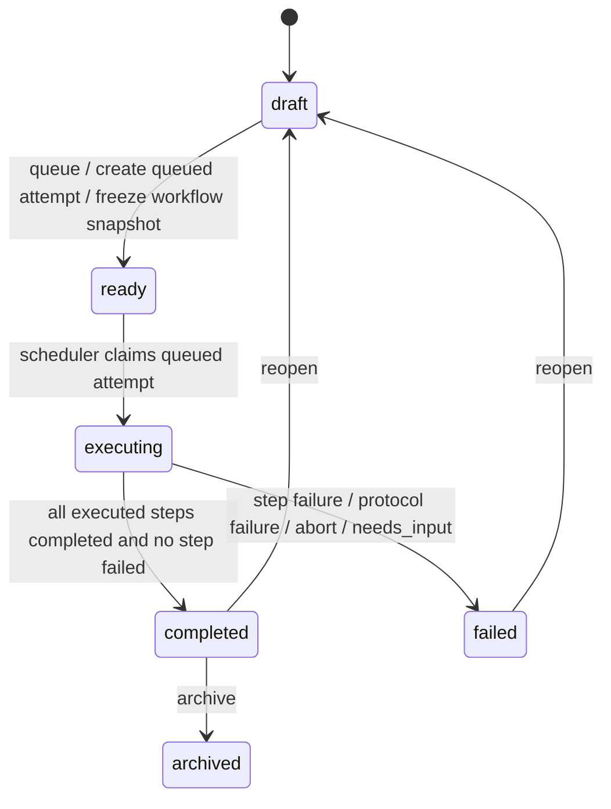
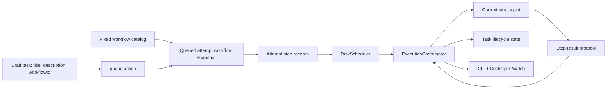

# refactor: Adopt Task Lifecycle And Workflow Execution Model

## Overview

这次不是继续在旧 runtime 语义上补洞，而是把任务生命周期、workflow 选择、attempt 历史和 step 执行边界重新立稳。目标是让 `draft / ready / executing / completed / failed / archived`、queued attempt、workflow snapshot 和 step-based orchestration 成为同一套自洽模型，避免后续每加一层能力都继续背旧状态和旧命名。

## Problem Frame

当前仓库仍然保留着一套会互相污染的旧边界：

- task lifecycle 还是 `initializing / pending_execution / pending_validation / execution_failed / reopened`
- task 顶层仍保留 `agent` 字段，但目标设计已经要求执行者只由 workflow steps 定义
- attempt 仍用单个 `stage` 字段表达 `plan / develop / self_check`
- workflow 仍只是 `workflowId / workflowLabel` 占位，没有冻结 snapshot 和 step records
- scheduler、runtime recovery、CLI、desktop、watch 输出都直接消费这些旧状态和旧字段

如果继续在这套模型上加“workflow 选择”“queued attempt 冻结合同”“每步不同 agent”“needs_input 收口”，后面会同时出现语义漂移、历史不可解释和跨层状态错配。

## Requirements Trace

| Area | Covered Requirements | Planning Consequence |
| --- | --- | --- |
| Task lifecycle refactor | R1-R7 | 需要移除 `reopened` 作为状态，统一收敛为 `draft / ready / executing / completed / failed / archived` |
| Workflow selection and snapshot semantics | R8-R11 | task 在 draft 阶段必须持有选中的 `workflowId`；当前版本 workflow 必选但不可编辑，queue 时冻结 workflow snapshot |
| Attempt and step model | R12-R23 | queued attempt 在进入 `ready` 时创建，并承载 snapshot 与 step records；执行者只存在于 step definitions 中 |
| Runtime orchestration and failure semantics | R24-R34 | scheduler claim `ready` 任务，runtime 按 step 串行执行；`needs_input` 是唯一交互失配失败语义 |
| Current-version scope limits | R21-R22, R30 | `skipped` 保留为合法状态定义，但当前版本不要求实现主动 skip 规则 |

## Scope Boundaries

- 当前版本 workflow 必选，但只支持从固定候选中选择；不交付 workflow 编辑器
- 不保留 task 顶层 `agent` 语义；执行者只存在于 workflow steps 中
- 不引入步骤级重试、并行步骤、条件分支执行或多 active attempts
- 不实现 human-in-the-loop 执行对话框、暂停恢复会话或执行中用户回复
- 不在当前版本实现会主动产出 `skipped` 的 runtime 规则；`skipped` 仅保留为后续扩展状态定义
- 不把步骤成功条件开放成用户可编辑的机器规则
- 不要求兼容现有本地 SQLite 测试数据；开发阶段允许直接重建状态库
- 不扩大成多 workspace、多人协作或远端 orchestration 设计

## Context & Research

### Relevant Code and Patterns

- [TaskState.ts](/D:/Code/Projects/tasks-dispatcher/packages/core/src/domain/TaskState.ts) 仍定义旧任务状态，是生命周期重构的主落点。
- [TaskStateMachine.ts](/D:/Code/Projects/tasks-dispatcher/packages/core/src/domain/TaskStateMachine.ts) 当前把 `reopened` 当作可编辑状态、把 `pending_validation` 当作可归档状态，必须整体改写。
- [Task.ts](/D:/Code/Projects/tasks-dispatcher/packages/core/src/domain/Task.ts) 当前既保存顶层 `agent`，又在 `queueForExecution()` 创建 attempt；它是“移除 task.agent + ready 创建 queued attempt”的核心边界。
- [TaskAttempt.ts](/D:/Code/Projects/tasks-dispatcher/packages/core/src/domain/TaskAttempt.ts) 当前只有单个 `stage` 和 attempt 级终止原因，是引入 workflow snapshot 与 step records 的直接迁移点。
- [TaskWorkflow.ts](/D:/Code/Projects/tasks-dispatcher/packages/core/src/domain/TaskWorkflow.ts) 当前只是默认 workflow 常量，需要升级为固定 workflow catalog、step definitions 和 snapshot 来源。
- [TaskDtos.ts](/D:/Code/Projects/tasks-dispatcher/packages/core/src/contracts/TaskDtos.ts) 与 [WorkspaceRuntimeApi.ts](/D:/Code/Projects/tasks-dispatcher/packages/core/src/contracts/WorkspaceRuntimeApi.ts) 仍暴露 task 顶层 `agent` 与旧 attempt `stage`，需要一起收敛。
- [TaskScheduler.ts](/D:/Code/Projects/tasks-dispatcher/packages/workspace-runtime/src/dispatching/TaskScheduler.ts) 目前只会抓 `pending_execution`，是 `ready` 无法被执行的直接断点。
- [ExecutionCoordinator.ts](/D:/Code/Projects/tasks-dispatcher/packages/workspace-runtime/src/dispatching/ExecutionCoordinator.ts) 当前只编排“一次 attempt 一个 agent 进程”，需要升级为 step-based orchestration。
- [AgentPromptFactory.ts](/D:/Code/Projects/tasks-dispatcher/packages/workspace-runtime/src/agents/AgentPromptFactory.ts) 和 [AgentAttemptWrapperProtocol.ts](/D:/Code/Projects/tasks-dispatcher/packages/workspace-runtime/src/agents/wrapper/AgentAttemptWrapperProtocol.ts) 仍围绕旧 `plan / develop / self_check` 和单次成功结果组织，必须升级为 step result protocol，并把 `needs_input` 纳入 failure reason。
- [SqliteTaskRepository.ts](/D:/Code/Projects/tasks-dispatcher/packages/workspace-runtime/src/persistence/SqliteTaskRepository.ts) 与 [001_initial_schema.sql](/D:/Code/Projects/tasks-dispatcher/packages/workspace-runtime/src/persistence/migrations/001_initial_schema.sql) 当前只能持久化 task/attempt 扁平字段，需要直接改写为新 schema，而不是做兼容迁移。
- [boardModel.ts](/D:/Code/Projects/tasks-dispatcher/apps/desktop/src/renderer/board/boardModel.ts)、[TaskStatusActions.tsx](/D:/Code/Projects/tasks-dispatcher/apps/desktop/src/renderer/components/TaskStatusActions.tsx)、[TaskDetailPane.tsx](/D:/Code/Projects/tasks-dispatcher/apps/desktop/src/renderer/components/TaskDetailPane.tsx) 和 [watch.ts](/D:/Code/Projects/tasks-dispatcher/apps/cli/src/commands/task/watch.ts) 都会暴露旧状态与旧 stage，需要一起切换。

### Institutional Learnings

- [task-vs-task-attempt-boundary-2026-03-29.md](/D:/Code/Projects/tasks-dispatcher/docs/solutions/best-practices/task-vs-task-attempt-boundary-2026-03-29.md)
  Task 和 TaskAttempt 的分层必须继续保留；step records 只能长在 attempt 下，不能回流到 task。
- [single-workspace-runtime-owner-2026-03-29.md](/D:/Code/Projects/tasks-dispatcher/docs/solutions/best-practices/single-workspace-runtime-owner-2026-03-29.md)
  状态推进和执行编排必须继续通过共享 runtime owner 收口，不能让 CLI 或 desktop 自行决定执行流。
- [windows-codex-process-launch-gotchas-2026-03-29.md](/D:/Code/Projects/tasks-dispatcher/docs/solutions/integration-issues/windows-codex-process-launch-gotchas-2026-03-29.md)
  任何“上一步退出 -> 下一步启动”的子进程编排，都要继续尊重 Windows 包装链和 wrapper 边界。

### External References

- 不做额外外部研究。当前问题由本仓库现有 domain 模型、runtime 编排和 UI/CLI 映射直接决定，本地证据足够。

## Key Technical Decisions

- **queued attempt 在进入 `ready` 时创建**：`queue` 不只是状态切换，还会创建新的 queued attempt，并把当前选中的 workflow 冻结成该次执行的 snapshot；`ready -> executing` 只是 claim 并启动它。
- **task 顶层不再保留 `agent` 字段**：执行者语义只存在于 workflow step definitions 中，避免 `task.agent` 和 `step.agent` 双重真相。
- **task 在 draft 阶段持有必选的 `workflowId`**：当前版本虽然只有固定候选，但仍保留“显式选择 workflow”这层语义，为后续扩展多 workflow 留稳定边界。
- **workflow 当前版本可选但不可编辑**：本轮只交付固定 workflow catalog，不交付 workflow editor，也不允许 task 在 snapshot 之外临时改 step 结构。
- **step-agent 支持校验从 task 创建期下沉到 workflow / runtime 边界**：task 创建时只校验 `workflowId`；系统拥有的 workflow catalog 必须只包含受支持的 step agents，queue/runtime 在创建 queued attempt 和启动当前 step 前都要继续校验这些 agents 可执行。
- **步骤定义和步骤运行记录彻底分开**：workflow template / snapshot 保存 `name / agent / prompt`；attempt 只保存 step runtime records、时间和 failure reason。
- **`needs_input` 是唯一交互失配失败语义**：当前版本一旦出现需要用户输入的执行路径，runtime 不进入对话模式，而是把 step、attempt 和 task 统一收口为 `failed/needs_input`。
- **Unit 3 依赖一个最小 step-result contract**：每个 step result 至少要能表达 `status`、`finishedAt`，以及失败时的 `failureReason`；`needs_input` 是正式 failure reason 之一。更丰富的 envelope 可以后续扩展，但这组最小字段必须先冻结。
- **`skipped` 保留定义但不进入当前版本主路径**：它是合法 step 终态，但本轮不实现会主动产出 `skipped` 的 runtime 规则，避免把当前版本扩成条件执行系统。
- **clean-schema 优先于兼容迁移**：当前处于开发阶段，直接改写现有 state schema 和 dev fixtures，必要时删除旧数据库，而不是引入一次性的 backfill 复杂度。
- **scheduler 与 runtime 共同构成唯一执行入口**：`TaskScheduler` 负责 claim `ready` 任务，`ExecutionCoordinator` 负责推进当前 attempt 的 step execution；CLI 和 desktop 只消费结果，不参与编排。

## Open Questions

### Resolved During Planning

- queued attempt 在进入 `ready` 时创建，而不是在进入 `executing` 时创建
- task 顶层 `agent` 移除，执行者只存在于步骤层
- task 在 draft 阶段必须持有选中的 `workflowId`
- 当前版本 workflow 必选但不可编辑，且只有固定候选
- step-agent 支持校验从 task 创建期下沉到 workflow / runtime 边界
- `needs_input` 是唯一交互失配失败语义，不再保留 `interaction_required`
- Unit 3 依赖最小 step-result contract：`status`、`finishedAt`、`failureReason`
- 当前版本不要求兼容现有本地 SQLite 测试数据
- `skipped` 保留状态定义，但当前版本不启用主动 skip 规则

### Deferred to Implementation

- workflow snapshot 与 step records 在持久化层采用单表 JSON、附表记录，还是混合模型更简洁
- 最小 step-result contract 之外，还需要保留哪些附加字段，才能在后续扩展更细的执行诊断而不污染当前版本边界
- runtime 应如何稳定识别“agent 进入需要用户输入路径”，并避免把普通说明性文字误判为 `needs_input`
- 当前版本是否继续复用 `currentAttemptId` 作为 queued/running/latest attempt 指针，还是需要在后续扩展时拆出更细的指针语义

## High-Level Technical Design

> This illustrates the intended approach and is directional guidance for review, not implementation specification. The implementing agent should treat it as context, not code to reproduce.

## Implementation Units

- [x] **Unit 1: Refactor core task lifecycle and workflow selection semantics**

**Goal:** 把 task lifecycle 收敛到新状态模型，同时移除 task 顶层 `agent`，让 draft task 显式持有必选的 `workflowId`。

**Requirements:** R1-R11, R14-R15, R24-R25

**Dependencies:** Must ship in the same switch window as Unit 2 unless a temporary compatibility layer is introduced explicitly.

**Files:**
- Modify: `packages/core/src/domain/TaskState.ts`
- Modify: `packages/core/src/domain/TaskStateMachine.ts`
- Modify: `packages/core/src/domain/Task.ts`
- Modify: `packages/core/src/domain/TaskWorkflow.ts`
- Modify: `packages/core/src/domain/TaskEvent.ts`
- Modify: `packages/core/src/domain/index.ts`
- Modify: `packages/core/src/application/services/CreateTaskService.ts`
- Modify: `packages/core/src/application/services/QueueTaskService.ts`
- Modify: `packages/core/src/application/services/ReopenTaskService.ts`
- Modify: `packages/core/src/application/services/GetTaskBoardService.ts`
- Modify: `packages/core/src/ports/AgentRuntimeRegistry.ts`
- Modify: `packages/workspace-runtime/src/agents/LocalAgentRuntimeRegistry.ts`
- Test: `packages/core/tests/domain/TaskStateMachine.test.ts`
- Test: `packages/core/tests/application/TaskLifecycleServices.test.ts`

**Approach:**
- 把旧状态字符串统一迁移到 `draft / ready / executing / completed / failed / archived`。
- `reopen()` 直接回到 `draft`，继续通过显式 event 表达动作，不保留 `reopened` 状态。
- `CreateTaskService` 不再要求 task 顶层 `agent`，而是要求一个显式的 `workflowId`。
- `TaskWorkflow.ts` 提供当前版本固定 workflow catalog，至少包含默认 `plan -> work -> review` 选项。
- `queue` 时校验选中的 `workflowId` 存在，并将 task 推进到 `ready`。
- step-agent 支持校验从 create 流程移到 workflow / runtime 边界：workflow catalog 负责只声明受支持的 agents，queue/runtime 再对 snapshot 中的 step agents 进行执行前校验。
- 默认执行路径应视为 Unit 1 + Unit 2 的同窗切换；如果实现者坚持把 Unit 1 单独落地，必须显式提供临时兼容层。

**Execution note:** Characterization-first. Replace old state-name assertions before relying on them for refactors.

**Patterns to follow:**
- 继续沿 [Task.ts](/D:/Code/Projects/tasks-dispatcher/packages/core/src/domain/Task.ts) 和 [TaskStateMachine.ts](/D:/Code/Projects/tasks-dispatcher/packages/core/src/domain/TaskStateMachine.ts) 的聚合式状态推进模式
- 保持 [task-vs-task-attempt-boundary-2026-03-29.md](/D:/Code/Projects/tasks-dispatcher/docs/solutions/best-practices/task-vs-task-attempt-boundary-2026-03-29.md) 的 task/attempt 边界

**Test scenarios:**
- Happy path: `draft -> ready -> executing -> completed -> archived` 的主生命周期保持合法
- Happy path: `completed -> reopen -> draft` 后重新允许编辑 task 内容和 workflow 选择
- Happy path: `failed -> reopen -> draft` 后重新允许编辑 task 内容和 workflow 选择
- Error path: 非 `draft` 状态不能编辑；非 `completed` 状态不能归档
- Error path: 创建 task 时未提供合法 `workflowId` 会被拒绝

**Verification:**
- core domain 不再暴露 `reopened`、`pending_execution`、`pending_validation`、`execution_failed`
- task snapshot 与 create API 不再暴露顶层 `agent`
- draft task 明确持有选中的 `workflowId`

- [x] **Unit 2: Introduce queued attempt snapshots and step records on the clean schema**

**Goal:** 让 queued attempt 成为 `ready` 冻结合同的唯一承载体，并把 workflow snapshot 与 step records 落到新的持久化模型上。

**Requirements:** R8-R23, R25, R30

**Dependencies:** Unit 1

**Files:**
- Modify: `packages/core/src/domain/TaskAttempt.ts`
- Modify: `packages/core/src/domain/Task.ts`
- Create: `packages/core/src/domain/TaskAttemptStep.ts`
- Create: `packages/core/src/domain/WorkflowStepStatus.ts`
- Modify: `packages/core/src/index.ts`
- Modify: `packages/workspace-runtime/src/persistence/SqliteTaskRepository.ts`
- Modify: `packages/workspace-runtime/src/persistence/WorkspaceStorage.ts`
- Modify: `packages/workspace-runtime/src/persistence/migrations/001_initial_schema.sql`
- Test: `packages/core/tests/domain/TaskAttempt.test.ts`
- Test: `packages/workspace-runtime/tests/persistence/SqliteTaskRepository.test.ts`
- Test: `packages/workspace-runtime/tests/persistence/WorkspaceStorage.test.ts`

**Approach:**
- `queue` 时创建新的 queued attempt，并把 task 当前选中的 workflow 冻结成 attempt-specific snapshot。
- step definitions 保留最小集合 `name / agent / prompt`；step runtime records 保存 `status`、时间、failure reason 等执行事实。
- `TaskAttempt` 从单个 `stage` 升级为“snapshot + current step key + step records + attempt termination reason”。
- 直接改写 clean schema，不做旧库 backfill；需要时删除旧开发数据库后重建。
- 在 schema 层和 repository 层保证“workflow snapshot 缺失”或“step records 不完整”不会被静默伪造。
- 这一单元只改 domain / persistence 边界，不在这里切 shared DTO 或 client-visible API contract；破坏性的 DTO/API 改动统一放到 Unit 4。

**Execution note:** Characterization-first. Legacy dev databases may be discarded instead of migrated.

**Patterns to follow:**
- 复用 [SqliteTaskRepository.ts](/D:/Code/Projects/tasks-dispatcher/packages/workspace-runtime/src/persistence/SqliteTaskRepository.ts) 的 task/attempt round-trip 模式
- 保持 [TaskWorkflow.ts](/D:/Code/Projects/tasks-dispatcher/packages/core/src/domain/TaskWorkflow.ts) 作为 workflow catalog 来源，不另起并行模板注册系统

**Test scenarios:**
- Happy path: `draft -> ready` 时创建 queued attempt，并附带 frozen workflow snapshot 与初始 step records
- Happy path: 历史 attempt 存在时，reopen 后再次 queue 会生成新的 queued attempt，旧 attempt snapshot 不被污染
- Edge case: `skipped` 仍是合法 step status 值，但当前版本 clean-state 路径默认不会自动生成 `skipped`
- Error path: workflow snapshot 或 step records 缺失时，repository 不会静默构造半残对象
- Integration: repository round-trip 后，workflow snapshot、step records 顺序、状态和 failure reason 都不丢失

**Verification:**
- queued attempt 已经成为 `ready` 冻结合同的唯一承载体
- clean schema 能稳定持久化 workflow snapshot + step records
- 旧 `stage` 字段不再作为 attempt 主语义存在

- [x] **Unit 3: Replace stage-based runtime execution with step-based orchestration**

**Goal:** 把 runtime 从“一次 attempt 一个 agent + 单个 stage”改成“一个 attempt 内按 step snapshot 串行执行多个 agent”，并把 `needs_input` 纳入正式失败收口。

**Requirements:** R12-R15, R20-R34

**Dependencies:** Unit 1, Unit 2. Unit 2 与 Unit 3 之间不应留下“新 snapshot / 旧 runtime contract”可长期运行的中间态。

**Files:**
- Modify: `packages/workspace-runtime/src/dispatching/TaskScheduler.ts`
- Modify: `packages/workspace-runtime/src/dispatching/ExecutionCoordinator.ts`
- Modify: `packages/workspace-runtime/src/dispatching/AgentProcessSupervisor.ts`
- Modify: `packages/workspace-runtime/src/agents/AgentPromptFactory.ts`
- Modify: `packages/workspace-runtime/src/agents/AgentRuntime.ts`
- Modify: `packages/workspace-runtime/src/agents/CodexCliRuntime.ts`
- Modify: `packages/workspace-runtime/src/agents/ClaudeCodeRuntime.ts`
- Modify: `packages/workspace-runtime/src/agents/wrapper/AgentAttemptWrapper.ts`
- Modify: `packages/workspace-runtime/src/agents/wrapper/AgentAttemptWrapperProtocol.ts`
- Modify: `packages/workspace-runtime/src/persistence/AttemptResultFileStore.ts`
- Modify: `packages/workspace-runtime/src/persistence/AttemptAbortSignalStore.ts`
- Modify: `packages/workspace-runtime/src/server/WorkspaceRuntimeService.ts`
- Test: `packages/workspace-runtime/tests/dispatching/TaskScheduler.test.ts`
- Test: `packages/workspace-runtime/tests/dispatching/ExecutionCoordinator.test.ts`
- Test: `packages/workspace-runtime/tests/agents/AgentAttemptWrapper.test.ts`
- Test: `packages/workspace-runtime/tests/agents/AgentProcessSupervisor.test.ts`

**Approach:**
- `TaskScheduler` 从 `ready` 队列中选择任务，并让 runtime claim 当前 queued attempt。
- `ExecutionCoordinator` 从 attempt snapshot 中找到当前待执行 step，启动该 step 对应的 agent。
- step 成功时先验证机器结果，再把该 step 标成 `completed` 并推进下一步；只有所有已执行步骤成功且没有 step failed 时，attempt 才成功。
- step result protocol 在这一单元内按最小 contract 冻结：至少包含 `status`、`finishedAt`，失败时包含 `failureReason`；`needs_input` 属于 step failure reason，同时驱动 attempt/task 收口。
- 当前版本不实现主动 skip rules；除非后续单独加入受控规则，否则 runtime 不应主动把 step 置为 `skipped`。
- 一旦 agent 进入需要用户输入的执行路径，runtime 以 `needs_input` 收口当前 step 与 attempt，并让 task 进入 `failed`。
- 正常路径下 agent 自然退出；只有 abort、timeout、startup failure 或协议异常时才强制终止。

**Execution note:** Characterization-first; Execution target: external-delegate

**Patterns to follow:**
- 保留 [ExecutionCoordinator.ts](/D:/Code/Projects/tasks-dispatcher/packages/workspace-runtime/src/dispatching/ExecutionCoordinator.ts) 作为 runtime 唯一收口者
- 保持 [single-workspace-runtime-owner-2026-03-29.md](/D:/Code/Projects/tasks-dispatcher/docs/solutions/best-practices/single-workspace-runtime-owner-2026-03-29.md) 的单 runtime owner 原则
- 继续遵守 [windows-codex-process-launch-gotchas-2026-03-29.md](/D:/Code/Projects/tasks-dispatcher/docs/solutions/integration-issues/windows-codex-process-launch-gotchas-2026-03-29.md) 的 Windows launch 分支

**Test scenarios:**
- Happy path: 默认 workflow `plan -> work -> review` 三步按顺序串行执行，最终 task 进入 `completed`
- Happy path: 上一步 agent 自然退出并写出合法 step result 后，runtime 才启动下一步骤 agent
- Error path: 任一步 step result 无效时，attempt 立即失败，task 进入 `failed`
- Error path: agent 输出需要用户输入的执行路径时，runtime 不进入对话模式，而是收口为 `needs_input`
- Error path: abort 在任一步运行中触发时，当前 step 与 attempt 都收口为中止失败
- Integration: Windows 下步骤切换、abort 与 wrapper 编排保持稳定

**Verification:**
- scheduler 不再依赖旧 `pending_execution`
- runtime 不再依赖旧 `develop / self_check` 阶段名推动 attempt
- `needs_input` 已成为正式 step/attempt failure reason

- [x] **Unit 4: Update contracts, CLI, desktop, and watch surfaces to the new model**

**Goal:** 让对外 contract 和现有 UI/CLI/watch 全部切到新 lifecycle、workflow 和 step execution 语义，不再暴露旧状态、旧 `stage` 或 task 顶层 `agent`。

**Requirements:** R1-R11, R19-R23, R24-R34

**Dependencies:** Unit 1, Unit 2, Unit 3

**Files:**
- Modify: `packages/core/src/contracts/TaskDtos.ts`
- Modify: `packages/core/src/contracts/index.ts`
- Modify: `packages/core/src/contracts/WorkspaceRuntimeApi.ts`
- Modify: `apps/cli/src/index.ts`
- Modify: `apps/cli/src/commands/task/create.ts`
- Modify: `apps/cli/src/commands/task/queue.ts`
- Modify: `apps/cli/src/commands/task/reopen.ts`
- Modify: `apps/cli/src/commands/task/archive.ts`
- Modify: `apps/cli/src/commands/task/show.ts`
- Modify: `apps/cli/src/commands/task/watch.ts`
- Modify: `apps/cli/tests/create-command.test.ts`
- Modify: `apps/cli/tests/state-commands.test.ts`
- Modify: `apps/desktop/src/renderer/board/boardModel.ts`
- Modify: `apps/desktop/src/renderer/components/CreateTaskModal.tsx`
- Modify: `apps/desktop/src/renderer/components/TaskComposer.tsx`
- Modify: `apps/desktop/src/renderer/components/TaskStatusActions.tsx`
- Modify: `apps/desktop/src/renderer/components/TaskCard.tsx`
- Modify: `apps/desktop/src/renderer/components/TaskDetailPane.tsx`
- Modify: `apps/desktop/src/renderer/components/TaskDetailModal.tsx`
- Modify: `apps/desktop/src/renderer/components/TaskSessionList.tsx`
- Modify: `apps/desktop/src/renderer/components/TaskSessionDetailModal.tsx`
- Modify: `apps/desktop/src/renderer/pages/TaskBoardPage.tsx`
- Test: `packages/workspace-runtime/tests/server/WorkspaceRuntimeClient.test.ts`
- Test: `apps/desktop/src/renderer/__tests__/TaskBoardPage.test.tsx`
- Test: `apps/desktop/src/renderer/__tests__/CreateTaskModal.test.tsx`
- Test: `apps/desktop/src/renderer/__tests__/TaskCard.test.tsx`
- Test: `apps/desktop/src/renderer/__tests__/TaskDetailModal.test.tsx`
- Test: `apps/desktop/src/renderer/__tests__/TaskSessionList.test.tsx`
- Test: `apps/desktop/src/renderer/__tests__/TaskSessionDetailModal.test.tsx`
- Test: `apps/desktop/src/renderer/__tests__/TaskStatusActions.test.tsx`
- Test: `apps/cli/tests/create-command.test.ts`
- Test: `apps/cli/tests/state-commands.test.ts`

**Approach:**
- 对外 contract 不再暴露 task 顶层 `agent`，改为展示选中的 workflow 与当前/历史 step execution 信息。
- CLI 根参数入口、`create` command 和 desktop 创建表单一起从 `agent` 输入切到 `workflowId` 输入，避免出现“底层 contract 已改，真实创建入口仍提交旧字段”的断层。
- board 的 `Review` 列改成 `Completed`，统一使用 `draft / ready / executing / completed / failed / archived`。
- task/session 详情展示当前 step 名、当前 step agent、step status 和 failure reason，而不是旧的单 `stage`。
- CLI `create` 改为要求 `workflowId`，`watch` 输出的事件 payload 与 detail DTO 一起切换到新语义。

**Execution note:** Execution target: external-delegate

**Patterns to follow:**
- 复用现有 [TaskStatusActions.tsx](/D:/Code/Projects/tasks-dispatcher/apps/desktop/src/renderer/components/TaskStatusActions.tsx) 和 [boardModel.ts](/D:/Code/Projects/tasks-dispatcher/apps/desktop/src/renderer/board/boardModel.ts) 的集中映射模式
- 保持 CLI、desktop 和 watch 继续通过 runtime contracts 消费状态，不绕过 runtime owner

**Test scenarios:**
- Happy path: board 正确显示 `Draft / Ready / Running / Completed / Failed / Archived`
- Happy path: CLI `create` 与 desktop 创建弹窗都提交 `workflowId`，不再提交 task 顶层 `agent`
- Happy path: `completed` 任务允许 `reopen` 和 `archive`，`failed` 任务只允许 `reopen`
- Happy path: task detail / session detail 可见当前 step 名、step agent、step status 和 failure reason
- Edge case: `draft` task 可编辑 workflow 选择；`ready` 后不再允许编辑
- Integration: CLI `create / show / queue / reopen / archive / watch`、desktop create flow 与 runtime client contract 一起切到新 workflow/step 字段

**Verification:**
- UI、CLI 和 watch 都不再暴露 `reopened`、`pending_validation`、`develop`、`self_check`
- 对外 surface 不再暴露 task 顶层 `agent`
- board 列名和状态动作与新 lifecycle 定义一致

- [x] **Unit 5: Rebuild regression coverage and operational cleanup around the new model**

**Goal:** 用测试和文档清理锁住新模型，避免后续继续被旧 lifecycle、旧 stage 和旧 task.agent 语义反噬。

**Requirements:** R1-R34

**Dependencies:** Unit 1, Unit 2, Unit 3, Unit 4

**Files:**
- Modify: `packages/core/tests/domain/TaskStateMachine.test.ts`
- Modify: `packages/core/tests/domain/TaskAttempt.test.ts`
- Modify: `packages/core/tests/application/TaskLifecycleServices.test.ts`
- Modify: `packages/workspace-runtime/tests/persistence/SqliteTaskRepository.test.ts`
- Modify: `packages/workspace-runtime/tests/persistence/WorkspaceStorage.test.ts`
- Modify: `packages/workspace-runtime/tests/dispatching/TaskScheduler.test.ts`
- Modify: `packages/workspace-runtime/tests/dispatching/ExecutionCoordinator.test.ts`
- Modify: `packages/workspace-runtime/tests/agents/AgentProcessSupervisor.test.ts`
- Modify: `apps/cli/tests/create-command.test.ts`
- Modify: `apps/cli/tests/state-commands.test.ts`
- Modify: `apps/desktop/src/renderer/__tests__/TaskBoardPage.test.tsx`
- Modify: `apps/desktop/src/main/__tests__/desktopStartupSmoke.test.ts`
- Modify: `README.md`
- Modify: `ONBOARDING.md`

**Approach:**
- 先替换所有锁旧状态名、旧 `stage` 和旧 task-agent 语义的测试，再建立新 lifecycle、workflow snapshot 和 step execution 的回归覆盖。
- 明确以 clean-state 方式运行 persistence 测试，不再为旧开发数据库构建兼容场景。
- 保留 desktop smoke，覆盖新列名、新 detail 信息和 `needs_input` 失败路径。
- 同步更新 README / ONBOARDING 中出现的旧状态名、旧 CLI 输入和旧运行语义。

**Execution note:** Characterization-first

**Patterns to follow:**
- 延续现有 core/runtime/desktop vitest 结构
- 保持 domain、persistence、runtime orchestration、CLI、renderer 各有一层回归，不把所有行为塞进单个 smoke

**Test scenarios:**
- Happy path: `draft -> ready -> executing -> completed -> archived`
- Happy path: `completed -> reopen -> draft -> ready -> executing` 产生第二个 queued attempt，第一 attempt snapshot 不变
- Error path: `needs_input` 收口为 `step failed -> attempt failed -> task failed`
- Error path: schema 重建后的 clean-state persistence 能正确 round-trip 新 snapshot 与 step records
- Integration: desktop smoke 能看到 `Completed` 列和新的 step-based session 信息
- Integration: 文档示例与 CLI 输入改为 `workflowId`，不再提及 task 顶层 `agent`

**Verification:**
- 全部测试改以新 lifecycle、workflow 和 step execution 语义为准
- 旧状态名、旧 stage 名和 task 顶层 `agent` 只出现在历史说明中，不再是系统主语义

## System-Wide Impact

- **Interaction graph:** core domain、clean schema、runtime orchestration、CLI、desktop、watch 输出都会同时吃到这次重构。
- **Error propagation:** `needs_input`、step failure、protocol failure、人工中止都需要从 step record -> attempt -> task -> DTO -> UI 层层保持语义不丢失。
- **API surface parity:** CLI、desktop 和 watch 必须一起迁移；不能出现一个入口仍说 `pending_validation` 或 `task.agent`，另一个已经切到新模型。
- **State lifecycle risks:** scheduler 选队列条件、runtime recovery、board 列映射和 action gating 都会因为 lifecycle 更名发生联动。
- **Data model changes:** 因为不做旧 SQLite 兼容，schema 可直接朝新模型收敛，但实现和测试必须明确清理旧 dev 状态库。
- **Unchanged invariants:** 单 workspace runtime owner、一个任务同一时刻一个 active attempt、wrapper 机器协议边界、现有 desktop modal 壳层都保持不变。

## Risks & Dependencies

| Risk | Mitigation |
|------|------------|
| `ready` 状态改完后 scheduler 仍抓旧 `pending_execution`，导致任务永远不执行 | 在 Unit 3 显式纳入 `TaskScheduler` 与对应测试，并把 `ready` claim 写进验收口径 |
| 移除 task 顶层 `agent` 后，contracts/UI/CLI 仍残留旧字段，形成双重执行语义 | 在 Unit 4 统一迁移 DTO、create/show/watch 输出和 desktop surfaces |
| step result protocol 不够明确，导致 `needs_input` 或协议失败误判 | 在 Unit 3 先固定最小 result envelope 与 failure reason 枚举，再推进 runtime 判定 |
| clean schema 改完后，旧 dev 数据库仍被误用，导致本地状态异常 | 在 operational notes 中明确要求重建 state DB，并让测试全部以 clean-state 运行 |
| `skipped` 定义被误当成当前版本必须实现的条件执行能力 | 在 requirements trace、scope boundaries 和 Unit 3 approach 中反复声明：当前版本不启用主动 skip rules |

## Documentation / Operational Notes

- 这轮是状态模型与执行模型重构，不是只改 UI 文案；README、ONBOARDING 和任何状态说明文档里出现的旧状态名、旧 stage 名、旧 task-agent 语义都要同步收敛。
- 实现开始前应删除旧的本地状态数据库和演示 workspace state，避免 clean schema 与旧 dev 数据混用。
- 如果后续要引入多 workflow 或主动 skip rules，应另起新的 requirements / plan，而不是把当前版本 silently 扩成条件执行系统。

## Sources & References

- **Origin document:** [2026-03-31-task-lifecycle-and-workflow-state-requirements.md](/D:/Code/Projects/tasks-dispatcher/docs/brainstorms/2026-03-31-task-lifecycle-and-workflow-state-requirements.md)
- Related code: [Task.ts](/D:/Code/Projects/tasks-dispatcher/packages/core/src/domain/Task.ts)
- Related code: [TaskAttempt.ts](/D:/Code/Projects/tasks-dispatcher/packages/core/src/domain/TaskAttempt.ts)
- Related code: [TaskWorkflow.ts](/D:/Code/Projects/tasks-dispatcher/packages/core/src/domain/TaskWorkflow.ts)
- Related code: [TaskScheduler.ts](/D:/Code/Projects/tasks-dispatcher/packages/workspace-runtime/src/dispatching/TaskScheduler.ts)
- Related code: [ExecutionCoordinator.ts](/D:/Code/Projects/tasks-dispatcher/packages/workspace-runtime/src/dispatching/ExecutionCoordinator.ts)
- Related code: [AgentPromptFactory.ts](/D:/Code/Projects/tasks-dispatcher/packages/workspace-runtime/src/agents/AgentPromptFactory.ts)
- Related code: [AgentAttemptWrapperProtocol.ts](/D:/Code/Projects/tasks-dispatcher/packages/workspace-runtime/src/agents/wrapper/AgentAttemptWrapperProtocol.ts)
- Related code: [TaskDetailPane.tsx](/D:/Code/Projects/tasks-dispatcher/apps/desktop/src/renderer/components/TaskDetailPane.tsx)
- Related code: [watch.ts](/D:/Code/Projects/tasks-dispatcher/apps/cli/src/commands/task/watch.ts)
- Institutional learning: [task-vs-task-attempt-boundary-2026-03-29.md](/D:/Code/Projects/tasks-dispatcher/docs/solutions/best-practices/task-vs-task-attempt-boundary-2026-03-29.md)
- Institutional learning: [single-workspace-runtime-owner-2026-03-29.md](/D:/Code/Projects/tasks-dispatcher/docs/solutions/best-practices/single-workspace-runtime-owner-2026-03-29.md)
- Institutional learning: [windows-codex-process-launch-gotchas-2026-03-29.md](/D:/Code/Projects/tasks-dispatcher/docs/solutions/integration-issues/windows-codex-process-launch-gotchas-2026-03-29.md)
